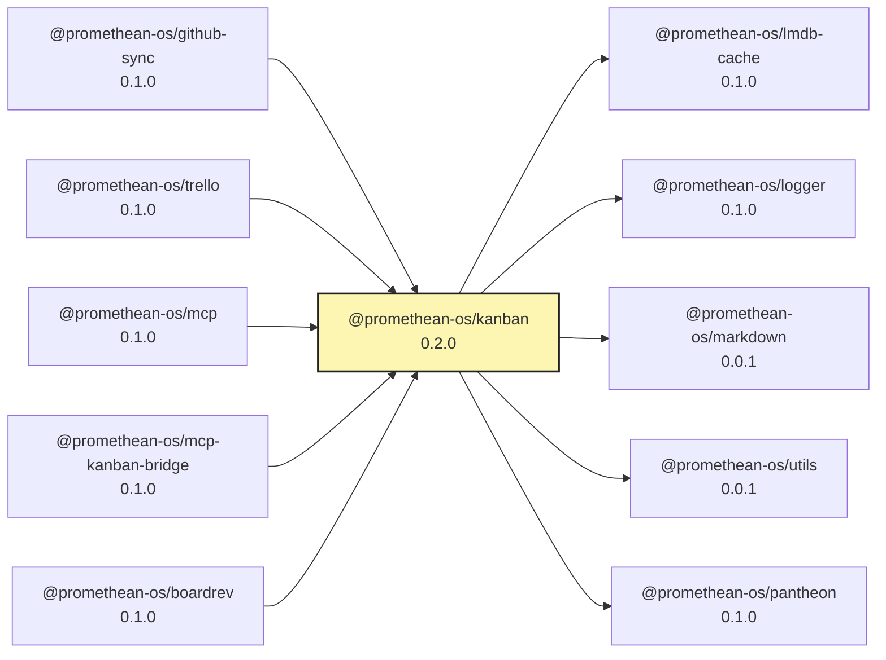

# @promethean-os/kanban

Automation for the local markdown kanban and process-as-code. Functional TS, native ESM, no side effects.

## Commands

```bash
pnpm kanban --help
```

Available subcommands: `count`, `getColumn`, `getByColumn`, `find`, `find-by-title`, `update_status`, `move_up`, `move_down`, `pull`, `push`, `sync`, `regenerate`, `indexForSearch`, `search`, `ui`, `process`, `process_sync`, `doccheck`, `create`, `update`, `delete`

Key commands:

- **CRUD Operations**:
  - `create` — create a new task with optional metadata.
  - `update` — update task title, content, or other properties.
  - `delete` — remove tasks (requires confirmation for safety).
- `regenerate` — rebuild board(s) from `docs/agile/tasks/*.md`.
- `sync` — two-way sync (board ⇄ tasks), then apply labels & PR checklists using a process config.
- `search` — search tasks by title/content.
- `find-by-title` — find task by exact title match.
- `update_status` — move task between columns.
- `count` — show task counts by status.
- `doccheck` — **docs guard**; fails if package source changes without corresponding docs changes.
- `pull` / `push` — low-level transforms used by `sync`.
- `indexForSearch` — JSON index for tasks.
- `process_sync` — run process pipeline (labels + checklists) defined in YAML.

- `pnpm kanban pull` – fold task frontmatter back into the board (like the old
  `hashtags_to_kanban.py`).
- `pnpm kanban push` – project the kanban columns to task files (successor to
  `kanban_to_hashtags.py`).
- `pnpm kanban sync` – run both directions and surface conflicting cards.
- `pnpm kanban regenerate` – rebuild the board from the current task folder.
- `pnpm kanban count --kanban path --tasks path` – quick stats for automation.
- `pnpm kanban ui --port 4173` – launch an interactive kanban dashboard in the
  browser (defaults to `http://127.0.0.1:4173`).
  All commands emit newline-delimited JSON for downstream tooling.

## CRUD Command Usage

### Create Tasks

```bash
# Basic task creation
pnpm kanban create "Implement new feature"

# With optional metadata
pnpm kanban create "Bug fix for login issue" \
  --priority=P1 \
  --labels="bug,login,urgent" \
  --content="Users cannot login with SSO credentials. Need to investigate OAuth flow." \
  --status=icebox
```

**Create flags:**

- `--priority <P0|P1|P2|P3>` - Set task priority (default: auto-generated from content)
- `--labels <label1,label2>` - Comma-separated labels
- `--content <text>` - Task description/content
- `--status <column>` - Target column (default: incoming, only icebox or incoming allowed for new tasks)

### Update Tasks

```bash
# Update task title
pnpm kanban update <task-uuid> --title "New updated title"

# Update task content
pnpm kanban update <task-uuid> --content "Updated description with new details"

# Update both title and content
pnpm kanban update <task-uuid> \
  --title "Comprehensive new title" \
  --content "Comprehensive new description with all details."
```

**Update flags:**

- `--title <text>` - New task title
- `--content <text>` - New task description/content
- `--priority <P0|P1|P2|P3>` - New priority level

### Delete Tasks

```bash
# Safe deletion (shows what will be deleted)
pnpm kanban delete <task-uuid>

# Confirmed deletion
pnpm kanban delete <task-uuid> --confirm
# or
pnpm kanban delete <task-uuid> -y
```

**Delete flags:**

- `--confirm` or `-y` - Skip confirmation prompt and delete immediately

**Note:** Tasks can be found using UUID from `find` or `search` commands: `pnpm kanban search "search term"`

## Configuration & Path Resolution

- The CLI discovers the repo root by walking up from the current working
  directory until it finds `.git` or `pnpm-workspace.yaml`. You can therefore run
  commands from any package or nested folder.
- `promethean.kanban.json` is the default configuration file. Any relative paths
  defined inside it are resolved against the directory that contains the config
  file.
- Override precedence:
  1. CLI flags (e.g. `--tasks-dir`, `--board-file`) resolved relative to the
     directory you invoke the command from.
  2. Environment variables (`KANBAN_TASKS_DIR`, `KANBAN_BOARD_FILE`, etc.)
     resolved relative to the detected repo root.
  3. Config file values resolved relative to the config directory.
- To target a different config file, pass `--config <path>` (relative to your
  shell) or set `KANBAN_CONFIG`. Once loaded, the file's own directory becomes
  the base for any relative entries.

## Paths

- Default board: `docs/agile/boards/generated.md`
- Default tasks directory: `docs/agile/tasks/`
- Default index: `docs/agile/boards/index.jsonl`
- Defaults are derived from the detected repo root; override via CLI flags or
  environment variables as noted above.

## Docs guard (all packages)

Enforced in CI by `.github/workflows/docs-guard.yml`. If a PR touches `packages/<slug>/src/**`, one of these must also change:

- `docs/packages/<slug>/**`
- `docs/services/<slug>/**`
- `docs/libraries/<slug>/**`
- `docs/apps/<slug>/**`

Bypass with label `skip-docs` (maintainers only). See `docs/contributing/docs-policy.md`.

## Web UI

Run `pnpm kanban ui` to start a lightweight HTTP server that renders the
workspace board as a responsive dashboard. The command respects the same
configuration flags as other subcommands, so `--kanban`, `--tasks`, `--host`,
and `--port` work as expected. The page refreshes automatically every minute,
and you can trigger a manual refresh from the "Refresh" button in the header.

## Notes

## Env

- `GITHUB_TOKEN`, `GITHUB_OWNER`, `GITHUB_REPO` for GitHub-side operations.
- `KANBAN_BOARD_FILE`, `KANBAN_TASKS_DIR` for explicit paths.

## Process config

See `docs/agile/process/README.md` for the YAML schema. An example lives at `docs/agile/process/duck-revival.yaml`.

## Promethean Packages (Remote READMEs)

- Back to [riatzukiza/promethean](https://github.com/riatzukiza/promethean#readme)

<!-- BEGIN: PROMETHEAN-PACKAGES-READMES -->
- [riatzukiza/agent-os-protocol](https://github.com/riatzukiza/agent-os-protocol#readme)
- [riatzukiza/ai-learning](https://github.com/riatzukiza/ai-learning#readme)
- [riatzukiza/apply-patch](https://github.com/riatzukiza/apply-patch#readme)
- [riatzukiza/auth-service](https://github.com/riatzukiza/auth-service#readme)
- [riatzukiza/autocommit](https://github.com/riatzukiza/autocommit#readme)
- [riatzukiza/build-monitoring](https://github.com/riatzukiza/build-monitoring#readme)
- [riatzukiza/cli](https://github.com/riatzukiza/cli#readme)
- [riatzukiza/clj-hacks-tools](https://github.com/riatzukiza/clj-hacks-tools#readme)
- [riatzukiza/compliance-monitor](https://github.com/riatzukiza/compliance-monitor#readme)
- [riatzukiza/dlq](https://github.com/riatzukiza/dlq#readme)
- [riatzukiza/ds](https://github.com/riatzukiza/ds#readme)
- [riatzukiza/eidolon-field](https://github.com/riatzukiza/eidolon-field#readme)
- [riatzukiza/enso-agent-communication](https://github.com/riatzukiza/enso-agent-communication#readme)
- [riatzukiza/http](https://github.com/riatzukiza/http#readme)
- [riatzukiza/kanban](https://github.com/riatzukiza/kanban#readme)
- [riatzukiza/logger](https://github.com/riatzukiza/logger#readme)
- [riatzukiza/math-utils](https://github.com/riatzukiza/math-utils#readme)
- [riatzukiza/mcp](https://github.com/riatzukiza/mcp#readme)
- [riatzukiza/mcp-dev-ui-frontend](https://github.com/riatzukiza/mcp-dev-ui-frontend#readme)
- [riatzukiza/migrations](https://github.com/riatzukiza/migrations#readme)
- [riatzukiza/naming](https://github.com/riatzukiza/naming#readme)
- [riatzukiza/obsidian-export](https://github.com/riatzukiza/obsidian-export#readme)
- [riatzukiza/omni-tools](https://github.com/riatzukiza/omni-tools#readme)
- [riatzukiza/opencode-hub](https://github.com/riatzukiza/opencode-hub#readme)
- [riatzukiza/persistence](https://github.com/riatzukiza/persistence#readme)
- [riatzukiza/platform](https://github.com/riatzukiza/platform#readme)
- [riatzukiza/plugin-hooks](https://github.com/riatzukiza/plugin-hooks#readme)
- [riatzukiza/report-forge](https://github.com/riatzukiza/report-forge#readme)
- [riatzukiza/security](https://github.com/riatzukiza/security#readme)
- [riatzukiza/shadow-conf](https://github.com/riatzukiza/shadow-conf#readme)
- [riatzukiza/snapshots](https://github.com/riatzukiza/snapshots#readme)
- [riatzukiza/test-classifier](https://github.com/riatzukiza/test-classifier#readme)
- [riatzukiza/test-utils](https://github.com/riatzukiza/test-utils#readme)
- [riatzukiza/utils](https://github.com/riatzukiza/utils#readme)
- [riatzukiza/worker](https://github.com/riatzukiza/worker#readme)
<!-- END: PROMETHEAN-PACKAGES-READMES -->

<!-- READMEFLOW:BEGIN -->
# @promethean-os/kanban

Automation for local markdown kanban and process-as-code. Functional TS, native ESM, no side effects.

[TOC]


## Install

```bash
pnpm -w add -D @promethean-os/kanban
```

## Quickstart

```ts
// usage example
```

## Commands

- `build`
- `build:cljs`
- `build:docs`
- `dev:cljs`
- `prepack`
- `test`
- `test:coverage`
- `coverage`
- `test:mutation`
- `test:mutation:debug`
- `test:mutation:dry`
- `build:dist`
- `clean`

## License

GPL-3.0-only


### Package graph




<!-- READMEFLOW:END -->
