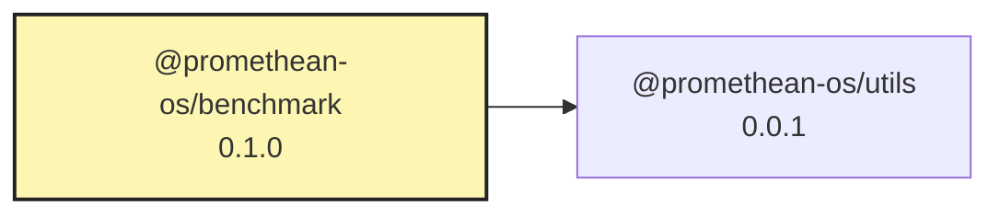

# @promethean-os/benchmark

> **🚀 The Unified AI Benchmarking Framework** - Comprehensive performance testing for AI model providers

A powerful, extensible benchmarking tool for comparing AI model providers including local (Ollama, vLLM, OpenVINO) and cloud (OpenAI, Anthropic, Mistral) services. Originally migrated from `@promethean-os/buildfix` to provide general-purpose benchmarking capabilities.

## ✨ Key Features

### 🏢 Multi-Provider Support

- **Local Providers**: Ollama, vLLM, OpenVINO (planned)
- **Cloud Providers**: OpenAI, Anthropic, Mistral (planned), OpenRouter (planned)
- **Specialized Providers**: BuildFix for TypeScript error fixing
- **Easy Extension**: Plugin architecture for custom providers

### 📊 Comprehensive Metrics

- **Performance Metrics**: TPS, latency, time-to-first-token, effectiveness scoring
- **Resource Monitoring**: Memory, CPU, GPU usage, power consumption
- **Quality Metrics**: Response quality, error rates, success rates
- **Comparative Analysis**: Provider rankings, statistical significance

### 🛠️ Developer Experience

- **Unified CLI**: Single command-line interface for all operations
- **Programmatic API**: Clean TypeScript API for integration
- **Rich Reporting**: JSON, Markdown, and HTML report formats
- **Configuration Management**: Flexible config files and environment variables

### 🔧 Advanced Features

- **Resource Monitoring**: Real-time system resource tracking
- **Statistical Analysis**: Confidence intervals, significance testing
- **Historical Tracking**: Trend analysis and performance over time
- **CI/CD Integration**: Built-in support for automated testing

## 🚀 Quick Start

### Installation

```bash
# Install as dependency
pnpm add @promethean-os/benchmark

# Or install globally for CLI usage
pnpm add -g @promethean-os/benchmark
```

### Prerequisites

Ensure you have at least one AI provider running:

```bash
# For Ollama (recommended for local testing)
ollama pull qwen2.5-coder:7b-instruct
ollama serve

# For vLLM (high-performance inference)
pip install vllm
python -m vllm.entrypoints.openai.api_server --model Qwen/Qwen2.5-Coder-7B-Instruct

# For OpenAI (cloud)
export OPENAI_API_KEY=your_api_key_here
```

### CLI Usage

```bash
# Quick health check of all configured providers
benchmark --health

# List available models from all providers
benchmark --list

# Run a quick comparison with default prompts
benchmark --compare --iterations 3

# Custom benchmark with specific prompt
benchmark --prompt "Write a fibonacci function in Python" --compare

# Test specific providers only
benchmark --providers ollama-local,vllm-local --compare

# Test BuildFix provider specifically
benchmark --providers buildfix-local --compare

# Use specific models
benchmark --models qwen2.5-coder:7b,gpt-4 --compare

# BuildFix-specific model testing
benchmark --providers buildfix-local --models qwen3:8b,qwen3:14b --compare
```

### Your First Benchmark

```bash
# 1. Check that providers are running
benchmark --health

# 2. See what models are available
benchmark --list

# 3. Run a simple comparison
benchmark --compare --iterations 3 --prompt "Explain quantum computing in simple terms"

# 4. View detailed results
cat benchmark-results/latest-report.md
```

### Programmatic Usage

```typescript
import { BenchmarkRunner, ProviderConfig } from '@promethean-os/benchmark';

// Initialize the benchmark runner
const runner = new BenchmarkRunner();

// Add providers for comparison
await runner.addProvider({
  name: 'ollama-local',
  type: 'ollama',
  endpoint: 'http://127.0.0.1:11434',
  model: 'qwen2.5-coder:7b-instruct',
});

await runner.addProvider({
  name: 'vllm-local',
  type: 'vllm',
  endpoint: 'http://localhost:8000',
  model: 'Qwen/Qwen2.5-Coder-7B-Instruct',
});

await runner.addProvider({
  name: 'openai-gpt4',
  type: 'openai',
  model: 'gpt-4',
  apiKey: process.env.OPENAI_API_KEY,
});

// Define benchmark requests
const requests = [
  {
    prompt: 'def fibonacci(n):',
    maxTokens: 200,
    metadata: { category: 'coding', language: 'python' },
  },
  {
    prompt: 'Write a REST API in Express.js',
    maxTokens: 500,
    metadata: { category: 'coding', language: 'javascript' },
  },
  {
    prompt: 'Explain machine learning in simple terms',
    maxTokens: 300,
    metadata: { category: 'explanation' },
  },
];

// Run comprehensive benchmark suite
const report = await runner.runBenchmarkSuite({
  name: 'Multi-Provider AI Comparison',
  requests,
  providers: [], // Use all added providers
  iterations: 3,
  warmupIterations: 1,
  timeout: 30000,
});

// Access results
console.log('🏆 Rankings:', report.summary.rankings);
console.log('📊 Best TPS:', report.summary.bestPerformance.tps);
console.log('💾 Most Efficient:', report.summary.mostEfficient.provider);

// Generate detailed report
await runner.generateReport(report, {
  format: 'markdown',
  outputPath: './benchmark-results/',
  includeCharts: true,
});
```

## 🏢 Supported Providers

### Local Providers

#### **Ollama** ⭐ Recommended

- **Description**: Local model serving with easy setup
- **Models**: Llama, Qwen, Mistral, CodeLlama, and more
- **Performance**: Good for development and testing
- **Setup**: `ollama pull qwen2.5-coder:7b-instruct && ollama serve`

```typescript
await runner.addProvider({
  name: 'ollama-local',
  type: 'ollama',
  endpoint: 'http://127.0.0.1:11434',
  model: 'qwen2.5-coder:7b-instruct',
  options: {
    temperature: 0.1,
    numPredict: 500,
  },
});
```

#### **vLLM** 🚀 High Performance

- **Description**: High-performance inference with PagedAttention
- **Models**: Optimized for large language models
- **Performance**: Excellent for production workloads
- **Setup**: Requires Python and vLLM installation

```typescript
await runner.addProvider({
  name: 'vllm-local',
  type: 'vllm',
  endpoint: 'http://localhost:8000',
  model: 'Qwen/Qwen2.5-Coder-7B-Instruct',
  options: {
    temperature: 0.1,
    max_tokens: 500,
  },
});
```

#### **OpenVINO** (Planned)

- **Description**: Intel CPU/iGPU optimization
- **Performance**: Optimized for Intel hardware
- **Status**: Coming soon

### Cloud Providers

#### **OpenAI** ☁️ Production Ready

- **Models**: GPT-3.5, GPT-4, GPT-4-turbo
- **Performance**: High quality, reliable
- **Setup**: Requires API key

```typescript
await runner.addProvider({
  name: 'openai-gpt4',
  type: 'openai',
  model: 'gpt-4',
  apiKey: process.env.OPENAI_API_KEY,
  options: {
    temperature: 0.1,
    max_tokens: 500,
  },
});
```

#### **BuildFix** 🔧 TypeScript Specialist

- **Models**: qwen3:8b, qwen3:14b, gpt-oss:20b-cloud (recommended)
- **Performance**: Specialized for TypeScript error fixing
- **Setup**: Requires Ollama with BuildFix-compatible models
- **Success Rate**: Currently 0% (integration complete, optimization in progress)

```typescript
await runner.addProvider({
  name: 'buildfix-local',
  type: 'buildfix',
  endpoint: 'http://127.0.0.1:11434',
  model: 'qwen3:8b',
  options: {
    errorContext: true,
    fixStrategy: 'conservative',
    maxRetries: 3,
    timeoutMs: 30000,
  },
});
```

#### **Anthropic Claude** (Planned)

- **Models**: Claude-3, Claude-3.5
- **Status**: Coming soon

#### **Mistral AI** (Planned)

- **Models**: Mistral-7B, Mixtral-8x7B
- **Status**: Coming soon

#### **OpenRouter** (Planned)

- **Description**: Model routing service
- **Models**: Access to multiple providers
- **Status**: Coming soon

### Specialized Providers

#### **BuildFix** 🔧 TypeScript Specialist

- **Description**: Specialized for TypeScript error fixing and automated code refactoring
- **Use Case**: Automated code fixing, error resolution, and TypeScript-specific optimizations
- **Integration**: Full integration with BuildFix system via unified benchmark CLI
- **Models**: Optimized for Ollama models (qwen3:8b, qwen3:14b, gpt-oss:20b-cloud)
- **Fixtures**: Supports both small test fixtures and massive real-world fixture sets

```typescript
await runner.addProvider({
  name: 'buildfix-local',
  type: 'buildfix',
  endpoint: 'http://127.0.0.1:11434',
  model: 'qwen3:8b',
  options: {
    errorContext: true,
    fixStrategy: 'conservative',
    maxRetries: 3,
    timeoutMs: 30000,
  },
});
```

#### **BuildFix Usage Examples**

```bash
# Quick BuildFix benchmark with small fixture set
pnpm --filter @promethean-os/benchmark benchmark --providers buildfix-local --iterations 3

# Comprehensive BuildFix testing with massive fixtures
pnpm --filter @promethean-os/benchmark benchmark --providers buildfix-local --suite buildfix-massive

# Compare BuildFix performance across different models
pnpm --filter @promethean-os/benchmark benchmark --providers buildfix-local --models qwen3:8b,qwen3:14b

# BuildFix with resource monitoring
pnpm --filter @promethean-os/benchmark benchmark --providers buildfix-local --monitor-resources --verbose
```

## 📊 Comprehensive Metrics

### 🚀 Performance Metrics

| Metric                  | Description                          | Unit         | Importance |
| ----------------------- | ------------------------------------ | ------------ | ---------- |
| **TPS**                 | Tokens Per Second - generation speed | tokens/sec   | ⭐⭐⭐     |
| **Latency**             | Total response time                  | milliseconds | ⭐⭐⭐     |
| **Time to First Token** | Initial response delay               | milliseconds | ⭐⭐       |
| **Time to Completion**  | Total generation time                | milliseconds | ⭐⭐       |
| **Effectiveness Score** | Response quality (0-1)               | score        | ⭐⭐⭐     |
| **Success Rate**        | Percentage of successful requests    | percentage   | ⭐⭐⭐     |
| **Error Rate**          | Percentage of failed requests        | percentage   | ⭐⭐       |

### 💻 Resource Metrics

| Metric                | Description                          | Unit       | Importance |
| --------------------- | ------------------------------------ | ---------- | ---------- |
| **Memory Usage**      | RAM consumption during inference     | MB         | ⭐⭐       |
| **CPU Usage**         | Processor utilization                | percentage | ⭐⭐       |
| **GPU Usage**         | Graphics processor utilization       | percentage | ⭐⭐       |
| **GPU Memory Usage**  | VRAM consumption                     | MB         | ⭐⭐       |
| **Power Consumption** | Energy usage (where available)       | watts      | ⭐         |
| **Temperature**       | System temperature (where available) | °C         | ⭐         |

### 📈 Quality Metrics

| Metric                 | Description                               | Unit  | Importance |
| ---------------------- | ----------------------------------------- | ----- | ---------- |
| **Response Relevance** | How well response matches prompt          | score | ⭐⭐⭐     |
| **Code Correctness**   | For coding tasks - functional correctness | score | ⭐⭐⭐     |
| **Coherence**          | Logical consistency of response           | score | ⭐⭐       |
| **Completeness**       | How completely the prompt is addressed    | score | ⭐⭐       |

### 📊 Comparative Metrics

| Metric                       | Description                           | Use Case              |
| ---------------------------- | ------------------------------------- | --------------------- |
| **Performance Ranking**      | Providers ranked by TPS               | Speed comparison      |
| **Efficiency Score**         | TPS per MB of memory used             | Resource efficiency   |
| **Cost Efficiency**          | Performance per dollar (for cloud)    | Cost optimization     |
| **Statistical Significance** | Confidence in performance differences | Scientific validation |

### 📋 Metric Examples

```typescript
// Sample benchmark result
{
  provider: 'ollama-local',
  metrics: {
    tps: 15.2,              // 15.2 tokens per second
    latency: 2340,          // 2.34 seconds total
    timeToFirstToken: 450,  // 450ms to first token
    effectiveness: 0.87,    // 87% quality score
    successRate: 0.95,      // 95% success rate
  },
  resources: {
    memoryUsage: 2048,      // 2GB RAM
    cpuUsage: 65,           // 65% CPU
    gpuUsage: 80,           // 80% GPU (if applicable)
    powerConsumption: 120,  // 120 watts
  },
  quality: {
    relevance: 0.92,        // 92% relevant
    correctness: 0.88,      // 88% correct
    coherence: 0.90,        // 90% coherent
    completeness: 0.85,     // 85% complete
  }
}
```

## ⚙️ Configuration

### Environment Variables

```bash
# OpenAI Configuration
OPENAI_API_KEY=your_openai_api_key_here
OPENAI_BASE_URL=https://api.openai.com/v1  # Optional custom endpoint

# Anthropic Configuration (when available)
ANTHROPIC_API_KEY=your_anthropic_api_key_here

# Mistral Configuration (when available)
MISTRAL_API_KEY=your_mistral_api_key_here

# Local Provider Endpoints
OLLAMA_ENDPOINT=http://127.0.0.1:11434
VLLM_ENDPOINT=http://localhost:8000

# Benchmark Configuration
BENCHMARK_TIMEOUT=30000              # Default timeout in ms
BENCHMARK_ITERATIONS=3               # Default iterations
BENCHMARK_WARMUP_ITERATIONS=1        # Default warmup iterations
BENCHMARK_OUTPUT_DIR=./benchmark-results
BENCHMARK_LOG_LEVEL=info             # debug, info, warn, error

# Resource Monitoring
RESOURCE_MONITORING=true             # Enable resource monitoring
RESOURCE_INTERVAL=1000               # Monitoring interval in ms
GPU_MONITORING=true                  # Enable GPU monitoring (if available)
```

### Configuration Files

#### `benchmark.config.js`

```javascript
export default {
  // Global defaults
  defaults: {
    iterations: 3,
    warmupIterations: 1,
    timeout: 30000,
    outputDir: './benchmark-results',
    logLevel: 'info',
  },

  // Provider configurations
  providers: [
    {
      name: 'ollama-local',
      type: 'ollama',
      endpoint: 'http://127.0.0.1:11434',
      model: 'qwen2.5-coder:7b-instruct',
      enabled: true,
      options: {
        temperature: 0.1,
        numPredict: 500,
        topK: 40,
        topP: 0.9,
      },
    },
    {
      name: 'vllm-local',
      type: 'vllm',
      endpoint: 'http://localhost:8000',
      model: 'Qwen/Qwen2.5-Coder-7B-Instruct',
      enabled: true,
      options: {
        temperature: 0.1,
        max_tokens: 500,
        top_p: 0.9,
      },
    },
    {
      name: 'openai-gpt4',
      type: 'openai',
      model: 'gpt-4',
      enabled: false, // Disabled by default (requires API key)
      options: {
        temperature: 0.1,
        max_tokens: 500,
        top_p: 0.9,
      },
    },
  ],

  // Benchmark suites
  suites: [
    {
      name: 'coding-benchmarks',
      description: 'Programming and code generation tasks',
      requests: [
        {
          prompt: 'Write a fibonacci function in Python',
          maxTokens: 200,
          metadata: {
            category: 'coding',
            language: 'python',
            difficulty: 'easy',
          },
        },
        {
          prompt: 'Implement a REST API using Express.js',
          maxTokens: 500,
          metadata: {
            category: 'coding',
            language: 'javascript',
            difficulty: 'medium',
          },
        },
        {
          prompt: 'Create a binary search algorithm in C++',
          maxTokens: 300,
          metadata: {
            category: 'coding',
            language: 'cpp',
            difficulty: 'medium',
          },
        },
      ],
    },
    {
      name: 'reasoning-benchmarks',
      description: 'Logical reasoning and problem-solving tasks',
      requests: [
        {
          prompt: 'Explain quantum computing in simple terms',
          maxTokens: 400,
          metadata: {
            category: 'explanation',
            complexity: 'high',
          },
        },
        {
          prompt: 'Solve this logic puzzle: There are three boxes...',
          maxTokens: 300,
          metadata: {
            category: 'reasoning',
            difficulty: 'medium',
          },
        },
      ],
    },
  ],

  // Reporting configuration
  reporting: {
    formats: ['json', 'markdown', 'html'],
    includeCharts: true,
    includeRawData: false,
    statisticalAnalysis: true,
    confidenceLevel: 0.95,
  },

  // Resource monitoring
  monitoring: {
    enabled: true,
    interval: 1000,
    trackMemory: true,
    trackCPU: true,
    trackGPU: true,
    trackPower: true,
  },
};
```

#### `benchmark.config.json` (Alternative)

```json
{
  "defaults": {
    "iterations": 3,
    "warmupIterations": 1,
    "timeout": 30000,
    "outputDir": "./benchmark-results"
  },
  "providers": [
    {
      "name": "ollama-local",
      "type": "ollama",
      "endpoint": "http://127.0.0.1:11434",
      "model": "qwen2.5-coder:7b-instruct",
      "enabled": true
    }
  ],
  "suites": [
    {
      "name": "quick-test",
      "requests": [
        {
          "prompt": "Hello, world!",
          "maxTokens": 50
        }
      ]
    }
  ]
}
```

### Provider Configuration Options

#### Ollama Provider

```typescript
{
  name: 'ollama-local',
  type: 'ollama',
  endpoint: 'http://127.0.0.1:11434',
  model: 'qwen2.5-coder:7b-instruct',
  options: {
    temperature: 0.1,        // 0.0-1.0, lower = more deterministic
    numPredict: 500,         // Maximum tokens to generate
    topK: 40,               // Top-k sampling
    topP: 0.9,              // Top-p sampling
    repeatPenalty: 1.1,     // Repetition penalty
    seed: 42,               // Random seed for reproducibility
    numCtx: 2048,           // Context window size
    numBatch: 512,          // Batch size
    numGpu: 1,              // Number of GPU layers
    numGpuLayers: 999,      // Number of layers to offload to GPU
    useMMap: true,          // Use memory mapping
    useMlock: false,        // Lock memory in RAM
    embeddingOnly: false,   // Embedding only mode
    f16KV: true,            // Use 16-bit key/value cache
    logitsAll: false,       // Return all logits
    vocabOnly: false,       // Return only vocabulary
    repeatLastN: 64,        // Last n tokens to penalize
    frequencyPenalty: 0.0,  // Frequency penalty
    presencePenalty: 0.0,   // Presence penalty
    tfsZ: 1.0,              // Tail free sampling parameter
    typicalP: 1.0,          // Typical sampling parameter
    mirostat: 0,            // Mirostat sampling (0, 1, or 2)
    mirostatTau: 5.0,       // Mirostat target entropy
    mirostatEta: 0.1,       // Mirostat learning rate
    penalizeNewline: true,  // Penalize newlines
    stop: ['\n'],           // Stop sequences
  },
}
```

#### vLLM Provider

```typescript
{
  name: 'vllm-local',
  type: 'vllm',
  endpoint: 'http://localhost:8000',
  model: 'Qwen/Qwen2.5-Coder-7B-Instruct',
  options: {
    temperature: 0.1,
    max_tokens: 500,
    top_p: 0.9,
    frequency_penalty: 0.0,
    presence_penalty: 0.0,
    stop: ['\n'],
    stream: false,          // Streaming responses
    best_of: 1,            // Number of best completions
    logprobs: null,        // Number of log probabilities to return
    echo: false,           // Echo the prompt in the response
    n: 1,                  // Number of completions to generate
    seed: null,            // Random seed
    user: null,            // User identifier
  },
}
```

#### OpenAI Provider

```typescript
{
  name: 'openai-gpt4',
  type: 'openai',
  model: 'gpt-4',
  apiKey: process.env.OPENAI_API_KEY,
  options: {
    temperature: 0.1,
    max_tokens: 500,
    top_p: 0.9,
    frequency_penalty: 0.0,
    presence_penalty: 0.0,
    stop: ['\n'],
    stream: false,
    logprobs: null,
    echo: false,
    n: 1,
    seed: null,
    user: null,
    response_format: { type: 'text' }, // or { type: 'json_object' }
  },
}
```

#### BuildFix Provider

```typescript
{
  name: 'buildfix-local',
  type: 'buildfix',
  endpoint: 'http://127.0.0.1:11434',
  model: 'qwen3:8b',
  options: {
    errorContext: true,
    fixStrategy: 'conservative',
    maxRetries: 3,
    timeoutMs: 30000,
    validateFixes: true,
    preserveFormatting: true,
    dslOptimization: true,
    errorTypes: ['TS2304', 'TS2305', 'TS2554', 'TS2322', 'TS2339'],
  },
}
```

## 🖥️ CLI Reference

### Installation

```bash
# Local installation
pnpm add @promethean-os/benchmark

# Global installation for CLI usage
pnpm add -g @promethean-os/benchmark

# Or use with npx
npx @promethean-os/benchmark --help
```

### Basic Commands

```bash
# Help and information
benchmark --help                    # Show help message
benchmark --version                 # Show version information

# Provider management
benchmark --health                  # Check health of all providers
benchmark --health --provider ollama-local  # Check specific provider
benchmark --list                    # List available models from all providers
benchmark --list --provider ollama-local    # List models from specific provider

# Benchmark operations
benchmark --compare                 # Compare all providers with default prompts
benchmark --compare --iterations 5  # Compare with 5 iterations
benchmark --prompt "Your prompt"   # Run single prompt benchmark
benchmark --suite coding-benchmarks # Run predefined benchmark suite

# Configuration
benchmark --config                  # Show current configuration
benchmark --config --validate       # Validate configuration
benchmark --init                    # Create default config file
```

### Advanced Options

```bash
# Execution control
--iterations N                      # Number of test iterations (default: 3)
--warmup N                         # Warmup iterations (default: 1)
--timeout N                        # Request timeout in milliseconds (default: 30000)
--concurrent N                     # Concurrent requests (default: 1)

# Provider selection
--providers provider1,provider2    # Specific providers to test
--models model1,model2             # Specific models to test
--exclude-providers provider1,provider2  # Exclude specific providers

# Prompt control
--prompt "text"                    # Custom prompt for benchmark
--prompts-file path/to/prompts.json # Load prompts from file
--suite suite-name                 # Use predefined benchmark suite
--category coding                  # Filter prompts by category

# Output control
--output-dir ./results             # Output directory (default: ./benchmark-results)
--format json,markdown,html        # Output formats (default: all)
--no-charts                        # Disable chart generation
--verbose                          # Verbose output
--quiet                            # Minimal output

# Resource monitoring
--monitor-resources                # Enable resource monitoring
--monitor-interval N              # Monitoring interval in ms (default: 1000)
--no-gpu-monitoring               # Disable GPU monitoring

# Analysis options
--statistical-analysis            # Enable statistical analysis
--confidence-level 0.95           # Confidence level for analysis (default: 0.95)
--significance-test               # Perform significance testing
```

### Examples

#### Quick Health Check

```bash
benchmark --health
```

#### Compare All Providers

```bash
benchmark --compare --iterations 5 --verbose
```

#### Test Specific Prompt

```bash
benchmark --prompt "Write a fibonacci function in Python" --compare
```

#### Run Coding Benchmarks

```bash
benchmark --suite coding-benchmarks --iterations 3 --monitor-resources
```

#### Compare Specific Models

```bash
benchmark --models qwen2.5-coder:7b,gpt-4 --prompt "Explain machine learning" --compare
```

#### Custom Output Configuration

```bash
benchmark --compare --output-dir ./my-results --format json,markdown --no-charts
```

#### BuildFix-Specific Benchmarks

```bash
# Quick BuildFix validation
benchmark --providers buildfix-local --iterations 3 --verbose

# BuildFix with massive fixture set
benchmark --providers buildfix-local --suite buildfix-massive --monitor-resources

# Compare BuildFix models
benchmark --providers buildfix-local --models qwen3:8b,qwen3:14b,gpt-oss:20b-cloud --compare

# BuildFix error type specific testing
benchmark --providers buildfix-local --category typescript-errors --iterations 5
```

#### Production Benchmark with Analysis

```bash
benchmark --suite coding-benchmarks \
  --iterations 10 \
  --warmup 2 \
  --monitor-resources \
  --statistical-analysis \
  --confidence-level 0.99 \
  --output-dir ./production-results
```

#### CI/CD Integration

```bash
# Non-interactive mode for CI/CD
benchmark --compare \
  --iterations 3 \
  --format json \
  --quiet \
  --output-dir ./ci-results
```

### Prompt Files

Create a `prompts.json` file for custom benchmark prompts:

```json
{
  "prompts": [
    {
      "prompt": "Write a fibonacci function in Python",
      "maxTokens": 200,
      "metadata": {
        "category": "coding",
        "language": "python",
        "difficulty": "easy"
      }
    },
    {
      "prompt": "Explain quantum computing in simple terms",
      "maxTokens": 400,
      "metadata": {
        "category": "explanation",
        "complexity": "high"
      }
    }
  ]
}
```

Then use with:

```bash
benchmark --prompts-file prompts.json --compare
```

## 🔌 API Reference

### Core Classes

#### BenchmarkRunner

Main class for running benchmarks and managing providers.

```typescript
class BenchmarkRunner {
  constructor(config?: BenchmarkConfig);

  // Provider management
  async addProvider(config: ProviderConfig): Promise<void>;
  async removeProvider(name: string): Promise<void>;
  async updateProvider(name: string, config: Partial<ProviderConfig>): Promise<void>;
  getProviders(): BaseProvider[];
  getProvider(name: string): BaseProvider | undefined;

  // Benchmark operations
  async runSingleBenchmark(
    providerName: string,
    request: BenchmarkRequest,
    options?: BenchmarkOptions,
  ): Promise<BenchmarkResult>;

  async runBenchmarkSuite(suite: BenchmarkSuite): Promise<BenchmarkReport>;

  async runComparativeBenchmark(
    requests: BenchmarkRequest[],
    providerNames?: string[],
    options?: ComparativeOptions,
  ): Promise<ComparativeReport>;

  // Provider utilities
  async listProviderModels(providerName: string): Promise<string[]>;
  async checkProviderHealth(providerName: string): Promise<HealthStatus>;
  async checkAllProvidersHealth(): Promise<Record<string, HealthStatus>>;

  // Reporting
  async generateReport(report: BenchmarkReport, options: ReportOptions): Promise<ReportOutput>;

  // Resource management
  async startResourceMonitoring(): Promise<void>;
  async stopResourceMonitoring(): Promise<void>;
  async getResourceMetrics(): Promise<ResourceMetrics>;

  // Cleanup
  async disconnectAll(): Promise<void>;
  async dispose(): Promise<void>;
}
```

#### BaseProvider

Abstract base class for all providers.

```typescript
abstract class BaseProvider {
  readonly config: ProviderConfig;
  readonly name: string;
  readonly type: string;

  abstract connect(): Promise<void>;
  abstract disconnect(): Promise<void>;
  abstract generate(request: BenchmarkRequest): Promise<BenchmarkResponse>;
  abstract listModels(): Promise<string[]>;
  abstract checkHealth(): Promise<HealthStatus>;

  // Optional methods
  async warmup?(): Promise<void>;
  async getCapabilities?(): Promise<ProviderCapabilities>;
  async estimateTokens?(text: string): Promise<number>;
}
```

### Type Definitions

#### Core Types

```typescript
interface BenchmarkConfig {
  defaults?: {
    iterations?: number;
    warmupIterations?: number;
    timeout?: number;
    outputDir?: string;
    logLevel?: 'debug' | 'info' | 'warn' | 'error';
  };
  providers?: ProviderConfig[];
  suites?: BenchmarkSuite[];
  reporting?: ReportingConfig;
  monitoring?: MonitoringConfig;
}

interface ProviderConfig {
  name: string;
  type: 'ollama' | 'vllm' | 'openai' | 'anthropic' | 'mistral' | 'buildfix';
  endpoint?: string;
  model: string;
  apiKey?: string;
  enabled?: boolean;
  options?: Record<string, any>;
  metadata?: Record<string, any>;
}

interface BenchmarkRequest {
  prompt: string;
  maxTokens?: number;
  temperature?: number;
  topP?: number;
  topK?: number;
  stop?: string[];
  metadata?: Record<string, any>;
  timeout?: number;
}

interface BenchmarkSuite {
  name: string;
  description?: string;
  requests: BenchmarkRequest[];
  providers?: string[]; // Provider names, empty = all
  iterations?: number;
  warmupIterations?: number;
  timeout?: number;
  metadata?: Record<string, any>;
}
```

#### Result Types

```typescript
interface BenchmarkResult {
  id: string;
  provider: ProviderConfig;
  request: BenchmarkRequest;
  response: BenchmarkResponse;
  metrics: BenchmarkMetrics;
  resources: ResourceMetrics;
  quality?: QualityMetrics;
  timestamp: Date;
  duration: number;
  success: boolean;
  error?: string;
  warnings?: string[];
}

interface BenchmarkResponse {
  content: string;
  finishReason?: 'stop' | 'length' | 'error';
  tokenCount: {
    prompt: number;
    completion: number;
    total: number;
  };
  model: string;
  metadata?: Record<string, any>;
}

interface BenchmarkMetrics {
  tps: number; // tokens per second
  latency: number; // milliseconds
  timeToFirstToken: number; // milliseconds
  timeToCompletion: number; // milliseconds
  effectiveness?: number; // 0-1 score
  successRate?: number; // 0-1 score
  errorRate?: number; // 0-1 score
  queueTime?: number; // milliseconds
  processingTime?: number; // milliseconds
}

interface ResourceMetrics {
  memoryUsage: number; // MB
  cpuUsage: number; // percentage
  gpuUsage?: number; // percentage
  gpuMemoryUsage?: number; // MB
  powerConsumption?: number; // watts
  temperature?: number; // celsius
  diskUsage?: number; // MB
  networkIO?: {
    bytesIn: number;
    bytesOut: number;
  };
}

interface QualityMetrics {
  relevance: number; // 0-1 score
  coherence: number; // 0-1 score
  completeness: number; // 0-1 score
  correctness?: number; // 0-1 score (for coding tasks)
  creativity?: number; // 0-1 score (for creative tasks)
  clarity: number; // 0-1 score
}
```

#### Report Types

```typescript
interface BenchmarkReport {
  id: string;
  name: string;
  description?: string;
  timestamp: Date;
  duration: number;
  suite: BenchmarkSuite;
  results: BenchmarkResult[];
  summary: ReportSummary;
  metadata: Record<string, any>;
}

interface ReportSummary {
  totalRequests: number;
  successfulRequests: number;
  failedRequests: number;
  averageLatency: number;
  averageTPS: number;
  bestPerformance: {
    provider: string;
    metrics: BenchmarkMetrics;
  };
  worstPerformance: {
    provider: string;
    metrics: BenchmarkMetrics;
  };
  mostEfficient: {
    provider: string;
    efficiency: number; // TPS per MB
  };
  rankings: ProviderRanking[];
  statisticalAnalysis?: StatisticalAnalysis;
  resourceUsage: Record<string, ResourceMetrics>;
}

interface ProviderRanking {
  provider: string;
  rank: number;
  score: number;
  metrics: BenchmarkMetrics;
  resources: ResourceMetrics;
  quality?: QualityMetrics;
}

interface ComparativeReport extends BenchmarkReport {
  comparisons: ProviderComparison[];
  recommendations: string[];
  significanceTests?: SignificanceTest[];
}

interface ProviderComparison {
  provider1: string;
  provider2: string;
  metric: string;
  difference: number;
  percentageDifference: number;
  winner: string;
  significance?: number; // p-value
}
```

#### Utility Types

```typescript
interface BenchmarkOptions {
  timeout?: number;
  warmup?: boolean;
  monitorResources?: boolean;
  collectQualityMetrics?: boolean;
  retries?: number;
  retryDelay?: number;
}

interface ComparativeOptions extends BenchmarkOptions {
  iterations?: number;
  warmupIterations?: number;
  statisticalAnalysis?: boolean;
  confidenceLevel?: number;
}

interface ReportOptions {
  format?: 'json' | 'markdown' | 'html' | 'csv';
  outputPath?: string;
  includeCharts?: boolean;
  includeRawData?: boolean;
  includeStatisticalAnalysis?: boolean;
  template?: string;
}

interface HealthStatus {
  healthy: boolean;
  responseTime?: number;
  error?: string;
  details?: Record<string, any>;
}

interface ProviderCapabilities {
  maxTokens?: number;
  supportsStreaming?: boolean;
  supportsFunctionCalling?: boolean;
  supportedModalities?: string[];
  pricing?: {
    inputTokenPrice: number;
    outputTokenPrice: number;
    currency: string;
  };
}
```

### Usage Examples

#### Basic Usage

```typescript
import { BenchmarkRunner } from '@promethean-os/benchmark';

const runner = new BenchmarkRunner();

// Add a provider
await runner.addProvider({
  name: 'ollama-local',
  type: 'ollama',
  model: 'qwen2.5-coder:7b-instruct',
});

// Run a single benchmark
const result = await runner.runSingleBenchmark('ollama-local', {
  prompt: 'Write a fibonacci function',
  maxTokens: 200,
});

console.log(`TPS: ${result.metrics.tps}`);
console.log(`Latency: ${result.metrics.latency}ms`);
```

#### Comparative Benchmark

```typescript
// Add multiple providers
await runner.addProvider({
  name: 'ollama-local',
  type: 'ollama',
  model: 'qwen2.5-coder:7b-instruct',
});

await runner.addProvider({
  name: 'vllm-local',
  type: 'vllm',
  model: 'Qwen/Qwen2.5-Coder-7B-Instruct',
});

// Run comparative benchmark
const report = await runner.runComparativeBenchmark(
  [
    { prompt: 'Write a fibonacci function', maxTokens: 200 },
    { prompt: 'Explain quantum computing', maxTokens: 300 },
  ],
  undefined, // All providers
  {
    iterations: 5,
    warmupIterations: 2,
    statisticalAnalysis: true,
    confidenceLevel: 0.95,
  },
);

console.log('Rankings:', report.summary.rankings);
```

#### Custom Provider

```typescript
import {
  BaseProvider,
  ProviderConfig,
  BenchmarkRequest,
  BenchmarkResponse,
} from '@promethean-os/benchmark';

class CustomProvider extends BaseProvider {
  constructor(config: ProviderConfig) {
    super(config);
  }

  async connect(): Promise<void> {
    // Initialize connection
  }

  async disconnect(): Promise<void> {
    // Cleanup connection
  }

  async generate(request: BenchmarkRequest): Promise<BenchmarkResponse> {
    // Generate response
    return {
      content: 'Generated response',
      finishReason: 'stop',
      tokenCount: { prompt: 10, completion: 20, total: 30 },
      model: this.config.model,
    };
  }

  async listModels(): Promise<string[]> {
    return ['model1', 'model2'];
  }

  async checkHealth(): Promise<HealthStatus> {
    return { healthy: true, responseTime: 100 };
  }
}

// Use custom provider
await runner.addProvider(
  new CustomProvider({
    name: 'custom-provider',
    type: 'custom',
    model: 'custom-model',
  }),
);
```

## 💡 Advanced Examples

### Example 1: Local vs Cloud Comparison

```typescript
import { BenchmarkRunner } from '@promethean-os/benchmark';

const runner = new BenchmarkRunner();

// Add local Ollama provider
await runner.addProvider({
  name: 'local-ollama',
  type: 'ollama',
  model: 'qwen2.5-coder:7b-instruct',
  options: { temperature: 0.1 },
});

// Add cloud OpenAI provider
await runner.addProvider({
  name: 'openai-gpt4',
  type: 'openai',
  model: 'gpt-4',
  apiKey: process.env.OPENAI_API_KEY,
  options: { temperature: 0.1 },
});

// Define comprehensive test suite
const codingSuite = {
  name: 'Local vs Cloud Coding Comparison',
  requests: [
    {
      prompt: 'Write a binary search algorithm in Python',
      maxTokens: 300,
      metadata: { category: 'coding', difficulty: 'medium' },
    },
    {
      prompt: 'Create a REST API using Express.js',
      maxTokens: 500,
      metadata: { category: 'coding', difficulty: 'hard' },
    },
    {
      prompt: 'Implement a linked list in C++',
      maxTokens: 400,
      metadata: { category: 'coding', difficulty: 'medium' },
    },
  ],
  iterations: 5,
  warmupIterations: 2,
};

// Run benchmark with resource monitoring
const report = await runner.runBenchmarkSuite(codingSuite);

// Analyze results
console.log('🏆 Overall Winner:', report.summary.rankings[0].provider);
console.log('📊 Best TPS:', report.summary.bestPerformance.tps);
console.log('💾 Most Efficient:', report.summary.mostEfficient.provider);

// Generate detailed report
await runner.generateReport(report, {
  format: ['markdown', 'html'],
  outputPath: './comparison-results/',
  includeCharts: true,
  includeStatisticalAnalysis: true,
});
```

### Example 2: Resource Usage Analysis

```typescript
// Start resource monitoring
await runner.startResourceMonitoring();

// Run intensive benchmark
const report = await runner.runBenchmarkSuite({
  name: 'Resource Intensive Test',
  requests: Array(10)
    .fill(null)
    .map((_, i) => ({
      prompt: `Generate complex algorithm ${i + 1}`,
      maxTokens: 1000,
      metadata: { intensity: 'high' },
    })),
  iterations: 3,
});

// Analyze resource efficiency
const resourceAnalysis = report.summary.resourceUsage;
const efficiencyRankings = Object.entries(resourceAnalysis)
  .map(([provider, resources]) => ({
    provider,
    memoryEfficiency:
      report.summary.rankings.find((r) => r.provider === provider)?.metrics.tps! /
      resources.memoryUsage,
    cpuEfficiency:
      report.summary.rankings.find((r) => r.provider === provider)?.metrics.tps! /
      resources.cpuUsage,
    overallEfficiency: resources.memoryUsage < 2000 && resources.cpuUsage < 80,
  }))
  .sort((a, b) => b.memoryEfficiency - a.memoryEfficiency);

console.log('📈 Resource Efficiency Rankings:');
efficiencyRankings.forEach((ranking, index) => {
  console.log(`${index + 1}. ${ranking.provider}`);
  console.log(`   Memory Efficiency: ${ranking.memoryEfficiency.toFixed(2)} TPS/MB`);
  console.log(`   CPU Efficiency: ${ranking.cpuEfficiency.toFixed(2)} TPS/%`);
  console.log(`   Overall Efficient: ${ranking.overallEfficiency ? '✅' : '❌'}`);
});
```

### Example 3: Custom Benchmark Suite

```typescript
// Create specialized benchmark suite for TypeScript
const typeScriptSuite = {
  name: 'TypeScript Code Generation',
  description: 'Benchmark for TypeScript-specific code generation tasks',
  requests: [
    {
      prompt: "Fix TypeScript error: Property 'name' does not exist on type 'User'",
      maxTokens: 200,
      metadata: {
        category: 'typescript',
        errorType: 'TS2339',
        difficulty: 'easy',
      },
    },
    {
      prompt: 'Add proper TypeScript types to this JavaScript function',
      maxTokens: 300,
      metadata: {
        category: 'typescript',
        task: 'typing',
        difficulty: 'medium',
      },
    },
    {
      prompt: 'Create a generic TypeScript interface for API responses',
      maxTokens: 250,
      metadata: {
        category: 'typescript',
        task: 'interface-design',
        difficulty: 'medium',
      },
    },
  ],
  iterations: 5,
  warmupIterations: 2,
};

// Run with BuildFix provider
await runner.addProvider({
  name: 'buildfix-typescript',
  type: 'buildfix',
  model: 'qwen3:8b',
  options: {
    errorContext: true,
    fixStrategy: 'typescript-optimized',
  },
});

const tsReport = await runner.runBenchmarkSuite(typeScriptSuite);

// Analyze TypeScript-specific performance
const tsMetrics = tsReport.results.filter((r) => r.request.metadata?.category === 'typescript');

const averageFixTime = tsMetrics.reduce((sum, r) => sum + r.metrics.latency, 0) / tsMetrics.length;
const successRate = tsMetrics.filter((r) => r.success).length / tsMetrics.length;

console.log(`🔧 TypeScript Performance:`);
console.log(`   Average Fix Time: ${averageFixTime.toFixed(0)}ms`);
console.log(`   Success Rate: ${(successRate * 100).toFixed(1)}%`);
```

### Example 4: Statistical Analysis

```typescript
// Run benchmark with statistical analysis
const statisticalReport = await runner.runComparativeBenchmark(
  [
    { prompt: 'Solve this math problem: What is 15% of 250?', maxTokens: 100 },
    { prompt: 'Write a recursive function to calculate factorial', maxTokens: 200 },
    { prompt: 'Explain the concept of recursion', maxTokens: 300 },
  ],
  ['ollama-local', 'vllm-local'],
  {
    iterations: 20, // Higher iterations for statistical significance
    warmupIterations: 5,
    statisticalAnalysis: true,
    confidenceLevel: 0.95,
  },
);

// Access statistical analysis
if (statisticalReport.summary.statisticalAnalysis) {
  const stats = statisticalReport.summary.statisticalAnalysis;

  console.log('📊 Statistical Analysis:');
  console.log(`   Confidence Level: ${stats.confidenceLevel * 100}%`);
  console.log(`   Sample Size: ${stats.sampleSize}`);

  // Show significance tests
  stats.significanceTests?.forEach((test) => {
    console.log(`   ${test.provider1} vs ${test.provider2}:`);
    console.log(`     ${test.metric}: p=${test.pValue.toFixed(4)}`);
    console.log(`     Significant: ${test.isSignificant ? '✅' : '❌'}`);
    console.log(`     Winner: ${test.winner}`);
  });
}
```

### Example 5: CI/CD Integration

```typescript
// benchmark-ci.ts - CI/CD integration script
import { BenchmarkRunner } from '@promethean-os/benchmark';
import { writeFileSync } from 'fs';

async function runCIBenchmark() {
  const runner = new BenchmarkRunner();

  // Add providers (configured via environment)
  if (process.env.OLLAMA_ENDPOINT) {
    await runner.addProvider({
      name: 'ci-ollama',
      type: 'ollama',
      endpoint: process.env.OLLAMA_ENDPOINT,
      model: process.env.OLLAMA_MODEL || 'qwen2.5-coder:7b-instruct',
    });
  }

  if (process.env.OPENAI_API_KEY) {
    await runner.addProvider({
      name: 'ci-openai',
      type: 'openai',
      model: process.env.OPENAI_MODEL || 'gpt-4',
      apiKey: process.env.OPENAI_API_KEY,
    });
  }

  // Quick CI benchmark
  const report = await runner.runBenchmarkSuite({
    name: 'CI Benchmark',
    requests: [
      { prompt: 'Hello, world!', maxTokens: 50 },
      { prompt: '2 + 2 = ?', maxTokens: 50 },
    ],
    iterations: 3,
    timeout: 10000, // Shorter timeout for CI
  });

  // Generate CI-friendly output
  const ciOutput = {
    timestamp: report.timestamp,
    summary: {
      totalProviders: report.summary.rankings.length,
      bestProvider: report.summary.rankings[0].provider,
      averageLatency: report.summary.averageLatency,
      successRate: report.summary.successfulRequests / report.summary.totalRequests,
    },
    rankings: report.summary.rankings.map((r) => ({
      provider: r.provider,
      tps: r.metrics.tps,
      latency: r.metrics.latency,
      success: r.metrics.successRate,
    })),
  };

  // Write results for CI consumption
  writeFileSync('benchmark-results.json', JSON.stringify(ciOutput, null, 2));

  // Exit with appropriate code
  const successRate = ciOutput.summary.successRate;
  process.exit(successRate >= 0.8 ? 0 : 1);
}

runCIBenchmark().catch(console.error);
```

## 🛠️ Development

### Setup

```bash
# Clone the repository
git clone https://github.com/your-org/promethean.git
cd promethean/packages/benchmark

# Install dependencies
pnpm install

# Build the package
pnpm build

# Run tests
pnpm test

# Run integration tests
pnpm test:integration

# Lint code
pnpm lint

# Type check
pnpm typecheck

# Run with local development
pnpm dev
```

### Project Structure

```
packages/benchmark/
├── src/
│   ├── benchmark.ts           # Main BenchmarkRunner class
│   ├── cli.ts                 # CLI implementation
│   ├── types/
│   │   └── index.ts          # Type definitions
│   ├── providers/
│   │   ├── index.ts          # Provider registry
│   │   ├── base.ts           # Base provider class
│   │   ├── ollama.ts         # Ollama provider
│   │   ├── vllm.ts           # vLLM provider
│   │   ├── openai.ts         # OpenAI provider
│   │   └── buildfix.ts       # BuildFix provider
│   ├── metrics/
│   │   ├── collector.ts      # Resource metrics collection
│   │   ├── analyzer.ts       # Performance analysis
│   │   └── statistical.ts    # Statistical analysis
│   ├── reporting/
│   │   ├── generator.ts      # Report generation
│   │   ├── templates/        # Report templates
│   │   └── charts.ts         # Chart generation
│   ├── utils/
│   │   ├── config.ts         # Configuration management
│   │   ├── validation.ts     # Input validation
│   │   ├── logger.ts         # Logging utilities
│   │   └── helpers.ts        # Helper functions
│   └── index.ts              # Main exports
├── tests/
│   ├── unit/                 # Unit tests
│   ├── integration/          # Integration tests
│   └── fixtures/             # Test fixtures
├── examples/                 # Usage examples
├── docs/                     # Documentation
├── package.json
├── tsconfig.json
├── README.md
└── CHANGELOG.md
```

### Adding a New Provider

1. **Create Provider Class**:

```typescript
// src/providers/myprovider.ts
import {
  BaseProvider,
  ProviderConfig,
  BenchmarkRequest,
  BenchmarkResponse,
  HealthStatus,
} from '../types';

export class MyProvider extends BaseProvider {
  async connect(): Promise<void> {
    // Initialize connection to your provider
  }

  async disconnect(): Promise<void> {
    // Cleanup connection
  }

  async generate(request: BenchmarkRequest): Promise<BenchmarkResponse> {
    // Generate response using your provider
    return {
      content: 'Generated response',
      finishReason: 'stop',
      tokenCount: { prompt: 10, completion: 20, total: 30 },
      model: this.config.model,
    };
  }

  async listModels(): Promise<string[]> {
    return ['model1', 'model2'];
  }

  async checkHealth(): Promise<HealthStatus> {
    return { healthy: true, responseTime: 100 };
  }
}
```

2. **Register Provider**:

```typescript
// src/providers/index.ts
import { MyProvider } from './myprovider';

export function createProvider(config: ProviderConfig): BaseProvider {
  switch (config.type) {
    case 'myprovider':
      return new MyProvider(config);
    // ... other providers
  }
}
```

3. **Add Tests**:

```typescript
// tests/integration/myprovider.test.ts
import { MyProvider } from '../../src/providers/myprovider';

describe('MyProvider', () => {
  let provider: MyProvider;

  beforeEach(() => {
    provider = new MyProvider({
      name: 'test-myprovider',
      type: 'myprovider',
      model: 'test-model',
    });
  });

  test('should connect successfully', async () => {
    await expect(provider.connect()).resolves.not.toThrow();
  });

  test('should generate response', async () => {
    await provider.connect();
    const response = await provider.generate({
      prompt: 'Test prompt',
      maxTokens: 100,
    });
    expect(response.content).toBeDefined();
  });
});
```

### Testing

```bash
# Run all tests
pnpm test

# Run unit tests only
pnpm test:unit

# Run integration tests only
pnpm test:integration

# Run tests with coverage
pnpm test:coverage

# Run tests in watch mode
pnpm test:watch

# Run specific test file
pnpm test src/providers/ollama.test.ts
```

### Debugging

```bash
# Enable debug logging
DEBUG=benchmark:* pnpm benchmark --compare

# Run with Node.js inspector
node --inspect-brk dist/cli.js --compare

# Run with verbose output
pnpm benchmark --compare --verbose
```

## 🤝 Contributing

We welcome contributions! Here's how to get started:

### Contributing Guidelines

1. **Fork the Repository**

   ```bash
   git clone https://github.com/your-username/promethean.git
   cd promethean/packages/benchmark
   ```

2. **Create a Feature Branch**

   ```bash
   git checkout -b feature/my-new-provider
   ```

3. **Make Your Changes**

   - Add your provider or feature
   - Include comprehensive tests
   - Update documentation
   - Follow the existing code style

4. **Run Tests**

   ```bash
   pnpm test
   pnpm lint
   pnpm typecheck
   ```

5. **Commit Your Changes**

   ```bash
   git commit -m "feat: add MyProvider support"
   ```

6. **Push and Create Pull Request**
   ```bash
   git push origin feature/my-new-provider
   # Create PR on GitHub
   ```

### Development Standards

- **Code Style**: Follow existing TypeScript patterns
- **Testing**: Maintain >90% test coverage
- **Documentation**: Update README and API docs
- **Breaking Changes**: Use semantic versioning
- **Performance**: Benchmark new features

### Provider Contribution Template

When adding a new provider, include:

1. **Provider Implementation**
2. **Configuration Options**
3. **Health Check Logic**
4. **Error Handling**
5. **Comprehensive Tests**
6. **Documentation**
7. **Usage Examples**

### Reporting Issues

- **Bug Reports**: Use GitHub Issues with detailed reproduction steps
- **Feature Requests**: Describe use case and expected behavior
- **Performance Issues**: Include benchmark results and system specs

## 📄 License

GPL-3 or later - see [LICENSE](../../LICENSE.txt) file for details.

## 🙏 Acknowledgments

- **Ollama Team** - For the excellent local model serving
- **vLLM Team** - For high-performance inference engine
- **OpenAI** - For the powerful API and models
- **BuildFix Team** - For the specialized TypeScript fixing capabilities

## 📞 Support

- **Documentation**: [Full API Docs](./docs/api.md)
- **Issues**: [GitHub Issues](https://github.com/your-org/promethean/issues)
- **Discussions**: [GitHub Discussions](https://github.com/your-org/promethean/discussions)
- **Email**: support@promethean.dev

---

**Built with ❤️ by the Promethean team**

<!-- READMEFLOW:BEGIN -->
# @promethean-os/benchmark


[TOC]


## Install

```bash
pnpm -w add -D @promethean-os/benchmark
```

## Quickstart

```ts
// usage example
```

## Commands

- `build`
- `clean`
- `typecheck`
- `test`
- `lint`
- `coverage`
- `format`
- `benchmark`
- `benchmark:compare`
- `benchmark:health`
- `benchmark:list`

## License

GPL-3.0-only


### Package graph




<!-- READMEFLOW:END -->
