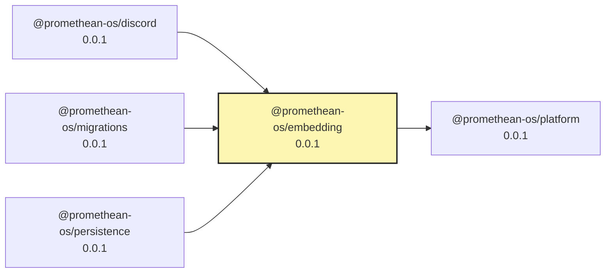

<!-- READMEFLOW:BEGIN -->
# @promethean-os/embedding


[TOC]


## Install

```bash
pnpm -w add -D @promethean-os/embedding
```

## Quickstart

```ts
// usage example
```

## Commands

- `build`
- `clean`
- `typecheck`
- `test`
- `lint`
- `coverage`

## License

GPL-3.0-only


### Package graph




<!-- READMEFLOW:END -->
