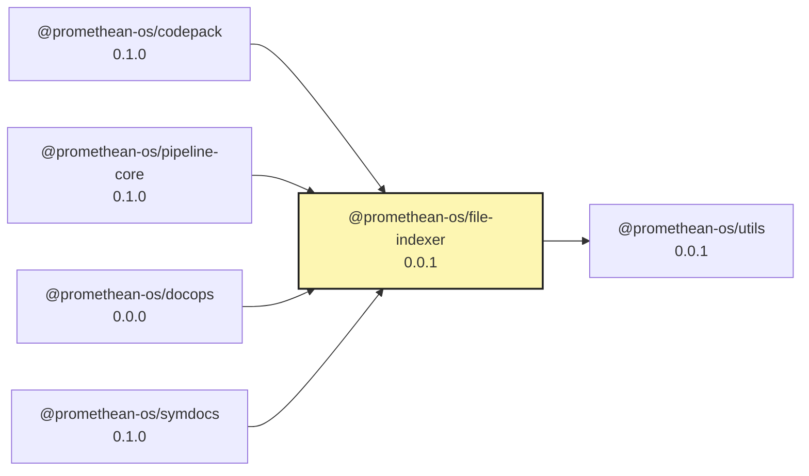

# @promethean-os/file-indexer

`@promethean-os/file-indexer` provides a high-level wrapper around
`@promethean-os/utils`'s `listFilesRec` helper. It adds callback hooks, optional
content reads, batching, and progress reporting so pipelines can scan large
workspaces without re-implementing traversal logic.

## Usage

```ts
import { scanFiles } from "@promethean-os/file-indexer";

await scanFiles({
  root: "/workspace/promethean/docs",
  exts: ["md", "mdx"],
  ignoreDirs: ["node_modules", "dist"],
  readContent: (filePath) => filePath.endsWith(".md"),
  batchSize: 25,
  onFile: async ({ path, content }) => {
    // run pipeline specific logic per file
  },
  onBatch: async (batch, progress) => {
    console.log(`Processed ${progress.processed}/${progress.total}`);
    // batch contains clones of the latest files, safe for async work
  },
  onProgress: ({ processed, total, percentage }) => {
    console.log(`${processed}/${total} (${(percentage * 100).toFixed(1)}%)`);
  },
});
```

### Options

- `exts`: filter extensions (dot prefix optional).
- `ignoreDirs`: directory names or relative paths to exclude.
- `readContent`: boolean or predicate to control when file text is loaded.
- `onFile`: async-safe callback invoked for each file.
- `onBatch` & `batchSize`: process files in grouped batches.
- `onProgress`: receive progress snapshots after each file.
- `collect`: set to `true` to include processed files in the returned result even
  when callbacks are supplied.

The function returns `{ total, processed, durationMs, files? }`. When neither
`onFile` nor `onBatch` is provided (or when `collect: true`), `files` contains
all processed entries, making it easy to reuse scan results downstream.

<!-- READMEFLOW:BEGIN -->
# @promethean-os/file-indexer


[TOC]


## Install

```bash
pnpm -w add -D @promethean-os/file-indexer
```

## Quickstart

```ts
// usage example
```

## Commands

- `build`
- `clean`
- `typecheck`
- `test`
- `lint`
- `coverage`
- `format`

## License

GPL-3.0-only


### Package graph




<!-- READMEFLOW:END -->
