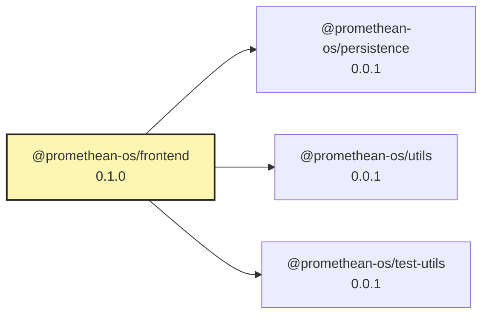

# @promethean-os/frontend

Consolidated frontend package for all Promethean UI applications.

## Applications

This package contains multiple frontend applications:

- **chat-ui** - ClojureScript chat UI for viewing and managing indexed conversations
- **docops** - Documentation operations frontend
- **duck-web** - Duck web frontend
- **kanban** - Kanban board frontend
- **openai-server** - OpenAI server frontend
- **opencode-session-manager** - Opencode session manager frontend
- **pantheon** - Web interface for Pantheon Agent Management Framework
- **piper** - Piper frontend
- **report-forge** - Report forge frontend
- **smartgpt-dashboard** - SmartGPT dashboard frontend

## Development

### Install Dependencies

```bash
pnpm install
```

### Development Mode

Start individual applications:

```bash
# ClojureScript applications
pnpm run dev:chat-ui
pnpm run dev:docops
pnpm run dev:duck-web
pnpm run dev:kanban
pnpm run dev:openai-server
pnpm run dev:opencode-session-manager
pnpm run dev:piper
pnpm run dev:report-forge
pnpm run dev:smartgpt-dashboard

# React/Vite application
pnpm run dev:pantheon
```

### Build

Build all applications:

```bash
pnpm run build
```

Build individual applications:

```bash
pnpm run build:shadow  # All ClojureScript apps
pnpm run build:ts     # TypeScript apps
pnpm run build:pantheon  # Pantheon React app
```

### Testing

```bash
pnpm run test
```

### Linting

```bash
pnpm run lint
```

### Type Checking

```bash
pnpm run typecheck
```

## Structure

```
src/
├── chat-ui/                 # Chat UI application
├── docops/                  # Documentation operations
├── duck-web/               # Duck web application
├── kanban/                 # Kanban board
├── openai-server/          # OpenAI server interface
├── opencode-session-manager/  # Opencode session manager
├── pantheon/               # Pantheon React application
├── piper/                  # Piper application
├── report-forge/           # Report forge
├── smartgpt-dashboard/     # SmartGPT dashboard
└── index.ts                # Main entry point
```

## Configuration

- **shadow-cljs.edn** - ClojureScript build configuration
- **vite.config.ts** - Vite configuration for Pantheon
- **tsconfig.json** - TypeScript configuration
- **ava.config.mjs** - Test configuration

<!-- READMEFLOW:BEGIN -->
# @promethean-os/frontend

Consolidated frontend package for all Promethean UI applications

[TOC]


## Install

```bash
pnpm -w add -D @promethean-os/frontend
```

## Quickstart

```ts
// usage example
```

## Commands

- `build`
- `build:shadow`
- `build:ts`
- `dev`
- `watch`
- `clean`
- `typecheck`
- `test`
- `lint`
- `coverage`
- `format`
- `dev:pantheon`
- `build:pantheon`
- `preview:pantheon`
- `pm2:start`
- `pm2:stop`
- `pm2:restart`
- `pm2:delete`
- `pm2:logs`
- `pm2:monit`
- `pm2:status`
- `pm2:dev`
- `pm2:prod`

## License

GPL-3.0-only


### Package graph




<!-- READMEFLOW:END -->
