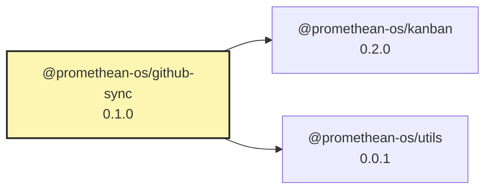

# GitHub Kanban Sync

Automatically sync kanban tasks from the internal Promethean kanban system to GitHub Projects v2 boards.

## 🚀 Quick Start

### Prerequisites

1. **Classic GitHub Token** (required for Projects v2 API):
   ```bash
   # Add to your .env file
   CLASSIC_GITHUB_TOKEN=ghp_your_classic_token_here
   ```

   ⚠️ **Important:** You must use a **Classic Personal Access Token**, not a fine-grained token. Create one at:
   https://github.com/settings/tokens with these scopes:
   - `repo` (Full control of private repositories)
   - `project` (Access projects)
   - `read:user` (Read user profile data)

### Usage

#### Complete Sync (Recommended)
```bash
# Full workflow: creates project, issues, and provides setup instructions
pnpm sync:kanban
```

#### Individual Components
```bash
# Just sync issues to existing project
CLASSIC_GITHUB_TOKEN=ghp_... node packages/github-sync/src/kanban-sync-final.mjs

# Check project status
CLASSIC_GITHUB_TOKEN=ghp_... node packages/github-sync/src/check-project-status.mjs

# Test classic token permissions
CLASSIC_GITHUB_TOKEN=ghp_... node packages/github-sync/src/test-classic-token.mjs
```

## 📋 What It Does

### ✅ **Automatic Sync Features**

1. **Project Creation:**
   - Automatically creates GitHub Projects v2 boards
   - Default project name: "generated" (configurable)
   - Supports multiple projects by name

2. **Issue Creation:**
   - Extracts tasks from internal kanban system
   - Creates detailed GitHub issues with full metadata
   - Preserves UUIDs for tracking
   - Adds comprehensive labels and status information

3. **Smart Organization:**
   - Prioritizes tasks (P1, P2, P3)
   - Groups by status (todo, in_progress, done, etc.)
   - Adds issues to project boards automatically

4. **Complete Metadata:**
   - Original task UUID for bidirectional sync
   - Status labels (todo, incoming, ready, etc.)
   - Priority labels (P1, P2, P3)
   - Original task content and descriptions
   - Sync timestamps and tracking information

### 🎯 **Target Tasks**

The sync searches for kanban-related tasks using:
- Exact matches: tasks with "kanban" in title or labels
- Similar matches: related development tasks
- Prioritizes by P1 → P2 → P3 ordering

## 📊 **Board Setup**

After running the sync, set up your kanban board view:

1. **Open the project** (URL provided in sync output)
2. **Click "Board" view**
3. **Add these columns:**
   - Icebox
   - Incoming
   - Accepted
   - Breakdown
   - Blocked
   - Ready
   - Todo
   - In Progress
   - Review
   - Document
   - Done
   - Rejected

4. **Auto-organization:** GitHub will automatically organize items based on their status labels

## 🔧 **Configuration**

### Environment Variables
```bash
# Required: Classic GitHub token
CLASSIC_GITHUB_TOKEN=ghp_your_token_here

# Optional: Custom settings
GITHUB_OWNER=your_username
GITHUB_REPO=your_repository
PROJECT_NAME=custom_project_name
```

### Package Scripts
```json
{
  "sync:kanban": "CLASSIC_GITHUB_TOKEN=${CLASSIC_GITHUB_TOKEN} node packages/github-sync/src/complete-kanban-sync.mjs",
  "sync:github:test": "node packages/github-sync/src/test-github-sync.mjs"
}
```

## 📁 **File Structure**

```
packages/github-sync/src/
├── complete-kanban-sync.mjs     # Complete workflow script
├── kanban-sync-final.mjs        # Core sync functionality
├── check-project-status.mjs     # Status checker and setup guide
├── test-classic-token.mjs       # Token permissions tester
├── demo-github-sync.mjs         # Demo mode (no API calls)
└── README.md                    # This file
```

## 🎨 **Example Output**

```
🚀 COMPLETE KANBAN SYNC WORKFLOW
🔑 Token: CLASSIC_GITHUB_TOKEN ✅
🎯 Target: riatzukiza/promethean
📋 Project: generated

✅ Created GitHub issues: 15
✅ Added to project: 15
❌ Failed: 0
📝 Total available: 39

🔗 GitHub Project: https://github.com/users/riatzukiza/projects/7
🔗 Repository Issues: https://github.com/riatzukiza/promethean/issues

🏷️  Created Issues in Project:
   ✅ #1626 Implement kanban dev command with real-time sync
   ✅ #1627 Migrate kanban system from JSONL to level-cache
   ✅ #1628 Implement WIP limit enforcement
   ...
```

## 🔍 **Troubleshooting**

### "Resource not accessible by personal access token"
- **Cause:** Using fine-grained token instead of classic token
- **Fix:** Create a classic personal access token with `repo` and `project` scopes

### "Project not found"
- **Cause:** Project doesn't exist or wrong permissions
- **Fix:** Verify repository access and token permissions

### "No kanban tasks found"
- **Cause:** Kanban board is empty or not accessible
- **Fix:** Run `pnpm kanban count` to verify board has tasks

## 🚀 **Future Enhancements**

- [ ] Bidirectional sync (GitHub → Internal kanban)
- [ ] Tag-based project generation
- [ ] Real-time webhook updates
- [ ] Multiple project support
- [ ] Custom column mappings
- [ ] Automated column creation via API

## 📝 **Development Notes**

- Uses GitHub Projects v2 GraphQL API
- Compatible with internal Promethean kanban system
- Node.js ES modules with fetch API
- Rate limiting and error handling included
- Works with both organization and user projects

<!-- READMEFLOW:BEGIN -->
# @promethean-os/github-sync


[TOC]


## Install

```bash
pnpm -w add -D @promethean-os/github-sync
```

## Quickstart

```ts
// usage example
```

## Commands

- `build`
- `test`

## License

GPL-3.0-only


### Package graph




<!-- READMEFLOW:END -->
