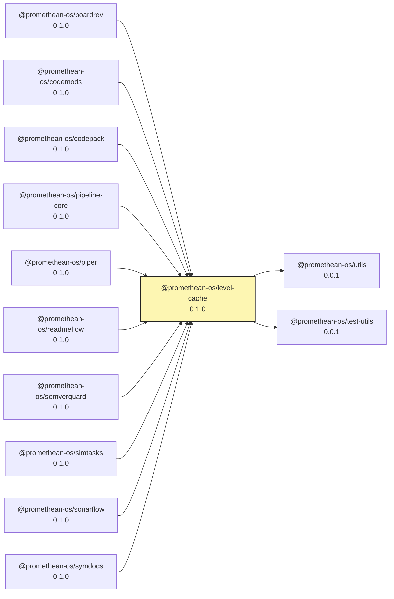

# packages/level-cache/README.md

# @promethean-os/level-cache

A tiny, embedded, **functional-style** cache on top of `level`:
- **No server**, no daemon.
- **TTL** via per-record expiry.
- **Lazy eviction** + explicit `sweepExpired()`.
- **Namespaces** without extra deps.
- Pure helpers; no hidden stateful loops.

## Install

```bash
pnpm -r add @promethean-os/level-cache
````

## Use

```typescript
import { openLevelCache } from "@promethean-os/level-cache";

const cache = await openLevelCache<{ foo: string }>({
  path: ".cache/level-cache",
  defaultTtlMs: 60_000,
  namespace: "docops"
});

await cache.set("k1", { foo: "bar" }, { ttlMs: 5_000 });
console.log(await cache.get("k1")); // { foo: 'bar' }

const userNs = cache.withNamespace("users");
await userNs.set("u:123", { foo: "baz" });

for await (const [k, v] of userNs.entries()) {
  console.log(k, v);
}

const removed = await cache.sweepExpired();
console.log({ removed });

await cache.close();
```

## Notes

* Expired keys are removed lazily on `get()` and during `entries()`; call `sweepExpired()` to clean proactively.
* Keys are encoded as `${namespace}␟${key}`; change safely by forking.
* Values default to `json` encoding via `level`.


## why this shape (systems-design POV)

- **No mutation:** APIs return new namespaced “views” instead of mutating global state.
- **No background timers:** predictable failure modes; you decide when to sweep.
- **No sublevel dependency:** zero extra moving parts; straight prefixing.
- **TTL as data, not behavior:** deletions are idempotent and safe.

<!-- READMEFLOW:BEGIN -->
# @promethean-os/level-cache


[TOC]


## Install

```bash
pnpm -w add -D @promethean-os/level-cache
```

## Quickstart

```ts
// usage example
```

## Commands

- `build`
- `clean`
- `typecheck`
- `test`

## License

GPL-3.0-only


### Package graph




<!-- READMEFLOW:END -->
