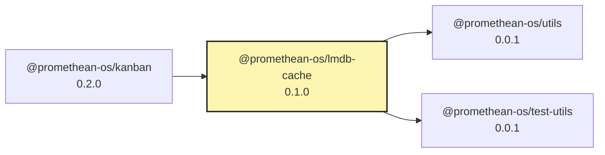

# @promethean-os/lmdb-cache

A high-performance, concurrency-optimized cache implementation using LMDB (Lightning Memory-Mapped Database) as a drop-in replacement for @promethean-os/level-cache.

## Features

- **Enhanced Concurrency**: LMDB provides superior multi-threaded performance compared to LevelDB
- **Drop-in Replacement**: API-compatible with @promethean-os/level-cache
- **TTL Support**: Built-in time-to-live functionality with automatic expiry
- **Namespace Support**: Logical key namespacing for data isolation
- **Batch Operations**: Efficient batch put/delete operations
- **Compression**: Built-in compression for space efficiency
- **TypeScript Support**: Full type safety and IntelliSense support

## Installation

```bash
pnpm add @promethean-os/lmdb-cache
```

## Usage

```typescript
import { openLmdbCache } from '@promethean-os/lmdb-cache';

// Open a cache
const cache = await openLmdbCache({
  path: './my-cache',
  defaultTtlMs: 24 * 60 * 60 * 1000, // 24 hours default TTL
  namespace: 'my-app'
});

// Basic operations
await cache.set('key', 'value');
const value = await cache.get('key');
const exists = await cache.has('key');

// TTL support
await cache.set('temp', 'data', { ttlMs: 60000 }); // 1 minute TTL

// Batch operations
await cache.batch([
  { type: 'put', key: 'key1', value: 'value1' },
  { type: 'put', key: 'key2', value: 'value2', ttlMs: 30000 },
  { type: 'del', key: 'old-key' }
]);

// Iterate over entries
for await (const [key, value] of cache.entries()) {
  console.log(key, value);
}

// Namespaces
const userCache = cache.withNamespace('users');
const sessionCache = cache.withNamespace('sessions');

// Cleanup expired entries
const deletedCount = await cache.sweepExpired();

// Close the cache
await cache.close();
```

## API

### CacheOptions

- `path: string` - Filesystem path for the LMDB database
- `defaultTtlMs?: number` - Default TTL in milliseconds (default: 24 hours)
- `namespace?: string` - Default namespace for keys

### Cache<T>

- `get(key: string): Promise<T | undefined>` - Get a value by key
- `has(key: string): Promise<boolean>` - Check if key exists
- `set(key: string, value: T, opts?: PutOptions): Promise<void>` - Set a value
- `del(key: string): Promise<void>` - Delete a key
- `batch(ops: BatchOperation[]): Promise<void>` - Execute batch operations
- `entries(opts?: { limit?: number }): AsyncGenerator<[string, T]>` - Iterate over entries
- `sweepExpired(): Promise<number>` - Delete expired entries, returns count
- `withNamespace(ns: string): Cache<T>` - Create namespaced cache view
- `close(): Promise<void>` - Close the database

### PutOptions

- `ttlMs?: number` - TTL in milliseconds for this specific entry

## Performance Benefits

LMDB provides several advantages over LevelDB:

1. **Better Concurrency**: LMDB uses MVCC (Multi-Version Concurrency Control) allowing multiple readers and writers without blocking
2. **Memory-Mapped**: Direct memory mapping provides faster access patterns
3. **Zero-Copy**: Reads can often be done without copying data
4. **Compression**: Built-in compression reduces storage requirements
5. **Transaction Safety**: ACID-compliant transactions with rollback support

## Migration from @promethean-os/level-cache

This package is designed as a drop-in replacement. Simply change your import:

```typescript
// Before
import { openLevelCache } from '@promethean-os/level-cache';

// After
import { openLmdbCache } from '@promethean-os/lmdb-cache';

// The rest of your code remains the same
const cache = await openLmdbCache(options);
```

## License

MIT

<!-- READMEFLOW:BEGIN -->
# @promethean-os/lmdb-cache


[TOC]


## Install

```bash
pnpm -w add -D @promethean-os/lmdb-cache
```

## Quickstart

```ts
// usage example
```

## Commands

- `build`
- `clean`
- `typecheck`
- `test`

## License

GPL-3.0-only


### Package graph




<!-- READMEFLOW:END -->
