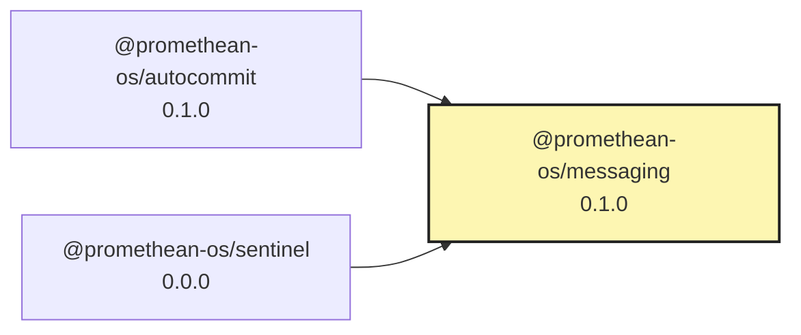

# @promethean-os/messaging

Unified RabbitMQ messaging utilities for the Promethean workspace. This package wraps `amqplib` with
connection pooling, consistent exchange/queue provisioning, publish/subscribe helpers, RPC utilities, and
instrumentation hooks that can be wired into Pantheon or the `@promethean-os/effects` decorators.

## Features

- **Connection manager** with bounded exponential backoff, confirm-channel reuse, and namespace-aware
  exchange/queue naming.
- **Event-style publish/subscribe** helpers that emit Promethean `EventRecord` payloads and expose ack/nack
  controls for consumers.
- **Request/response (RPC)** utilities backed by reply queues and correlation IDs.
- **Pantheon-compatible adapter** for the `MessageBus` port so orchestrators can switch from in-memory brokers
 to RabbitMQ without touching downstream actors.
- **Instrumentation hooks** so teams can plug metrics/tracing (or `@promethean-os/effects`) into every bus action.

## Usage

```ts
import {
  createRabbitMessageBus,
  resolveRabbitConfigFromEnv,
} from "@promethean-os/messaging";

const bus = createRabbitMessageBus({
  contextOptions: {
    config: resolveRabbitConfigFromEnv(),
  },
});

await bus.send({ from: "pantheon", to: "agent-123", content: "wake" });
const unsubscribe = bus.subscribe((msg) => {
  console.log(`${msg.to} received: ${msg.content}`);
});
```

See `spec/rabbitmq-bus-consolidation.md` for the full architectural goals and migration roadmap.

<!-- READMEFLOW:BEGIN -->
# @promethean-os/messaging


[TOC]


## Install

```bash
pnpm -w add -D @promethean-os/messaging
```

## Quickstart

```ts
// usage example
```

## Commands

- `build`
- `clean`
- `typecheck`
- `test`
- `lint`
- `coverage`

## License

GPL-3.0-only


### Package graph




<!-- READMEFLOW:END -->
