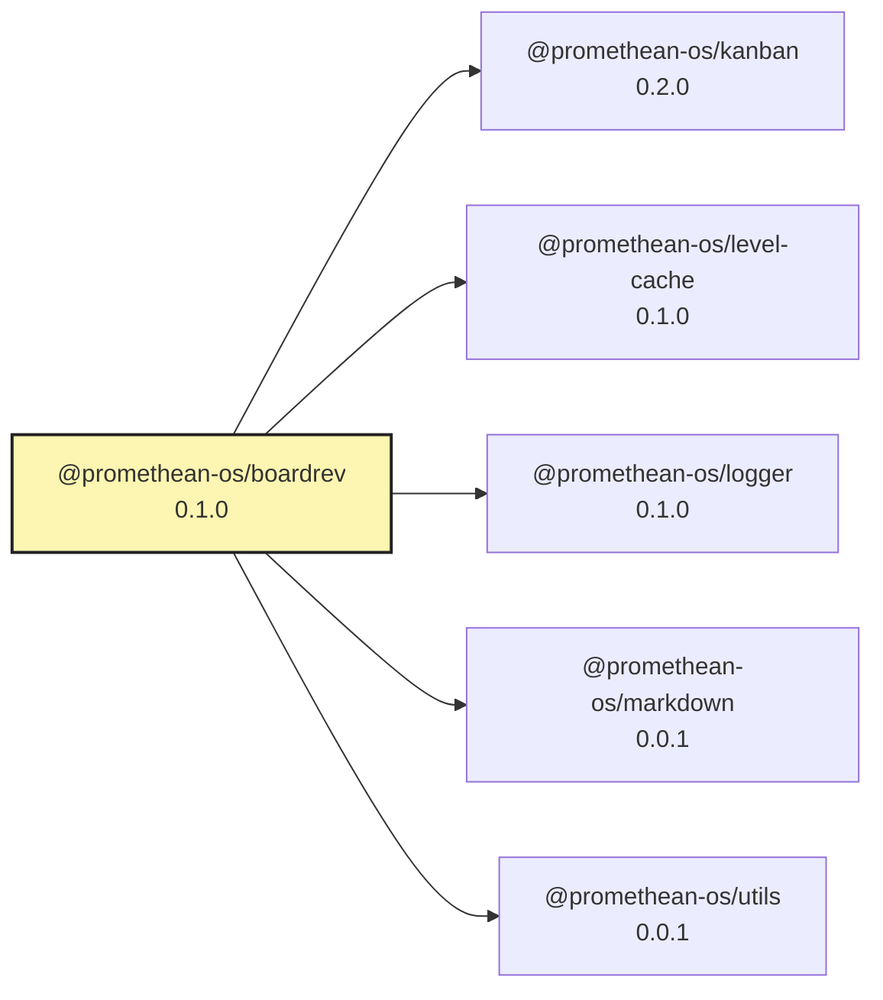

<!-- READMEFLOW:BEGIN -->
# @promethean-os/boardrev


[TOC]


## Install

```bash
pnpm -w add -D @promethean-os/boardrev
```

## Quickstart

```ts
// usage example
```

## Commands

- `build`
- `br:01-fm`
- `br:02-prompts`
- `br:03-index`
- `br:03-index-incremental`
- `br:04-match`
- `br:04-enhanced`
- `br:05-eval`
- `br:06-report`
- `br:07-wip`
- `br:all`
- `br:all-enhanced`
- `monitor:start`
- `monitor:stop`
- `monitor:status`
- `monitor:trigger`
- `watch:demo`
- `schedule:demo`
- `test`

## License

GPL-3.0-only


### Package graph




<!-- READMEFLOW:END -->
