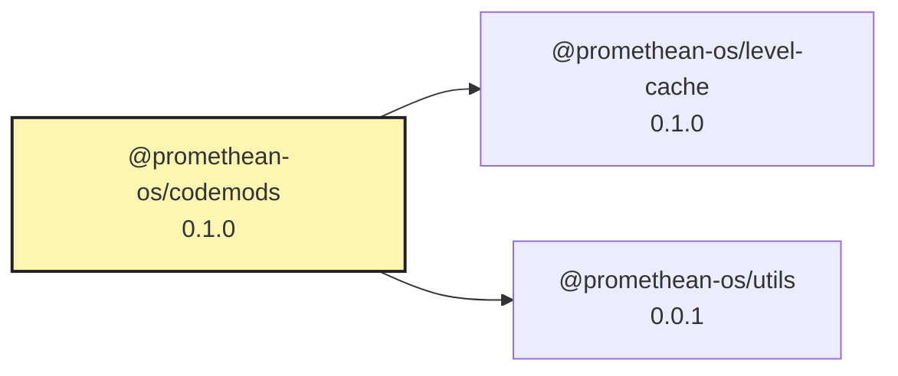

<!-- READMEFLOW:BEGIN -->
# @promethean-os/codemods


[TOC]


## Install

```bash
pnpm -w add -D @promethean-os/codemods
```

## Quickstart

```ts
// usage example
```

## Commands

- `build`
- `mods:01-spec`
- `mods:02-generate`
- `mods:03-dry-run`
- `mods:03-apply`
- `mods:all`

## License

GPL-3.0-only


### Package graph




<!-- READMEFLOW:END -->
