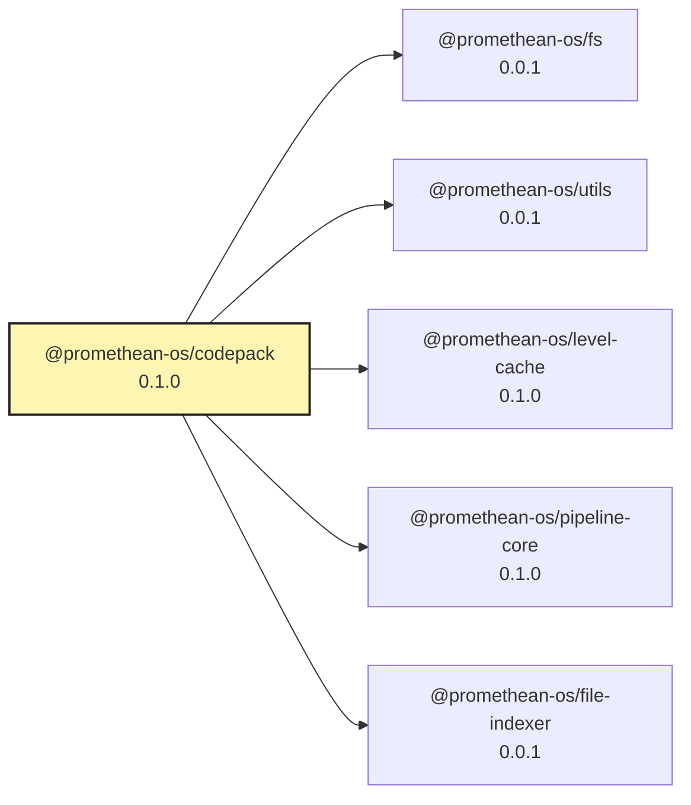

<!-- READMEFLOW:BEGIN -->
# @promethean-os/codepack


[TOC]


## Install

```bash
pnpm -w add -D @promethean-os/codepack
```

## Quickstart

```ts
// usage example
```

## Commands

- `build`
- `test`
- `lint`
- `code:01-extract`
- `code:02-embed`
- `code:03-cluster`
- `code:04-name`
- `code:05-materialize`
- `code:all`

## License

GPL-3.0-only


### Package graph




<!-- READMEFLOW:END -->
