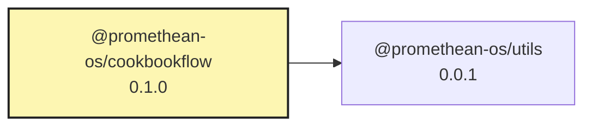

<!-- READMEFLOW:BEGIN -->
# @promethean-os/cookbookflow


[TOC]


## Install

```bash
pnpm -w add -D @promethean-os/cookbookflow
```

## Quickstart

```ts
// usage example
```

## Commands

- `build`
- `cb:01-scan`
- `cb:02-embed-classify`
- `cb:03-group`
- `cb:04-plan`
- `cb:05-materialize`
- `cb:06-exec`
- `cb:07-verify`
- `cb:08-report`
- `cb:all`

## License

GPL-3.0-only


### Package graph




<!-- READMEFLOW:END -->
