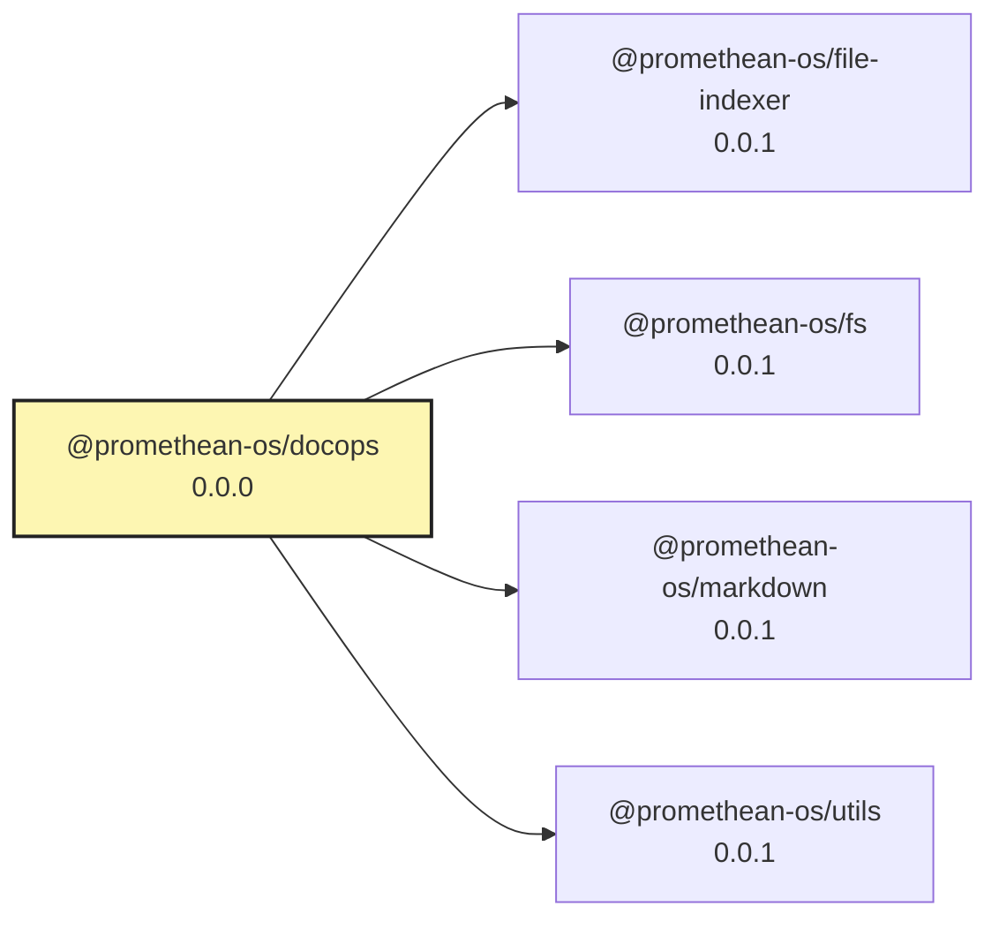

# @promethean-os/docops

DocOps is a modular documentation pipeline that parses, embeds, queries, relates, and renders Markdown documents. It exposes pure JS/TS functions, a small dev server with a Web UI, and preserves standalone CLI usage for compatibility. For a generic pipeline UI, you can also use [[packages/piper/README|Piper]].

## Features

- Pure functions with dependency injection (LevelDB, Chroma)
- Steps: frontmatter → embed → query → relations → rename → footers
- Preview endpoint to see expected frontmatter without writing
- Web Components UI for per-step runs and full pipeline
- Streaming progress via Server-Sent Events (SSE)

## Quick Start

- UI:

```bash
pnpm --filter @promethean-os/piper dev-ui -- --config packages/docops/pipelines.json
# open http://localhost:3939
```

- Programmatic:

```ts
import { openDB } from './src/db';
import { runFrontmatter, runEmbed, runQuery, runRelations, runFooters, runRename } from './src';
import { ChromaClient } from 'chromadb';
import { OllamaEmbeddingFunction } from '@chroma-core/ollama';
import { OLLAMA_URL } from './src/utils';

const db = await openDB();
const client = new ChromaClient({});
const embedModel = 'nomic-embed-text:latest';
const coll = await client.getOrCreateCollection({
  name: 'docs-cosine',
  metadata: { embed_model: embedModel, 'hnsw:space': 'cosine' },
  embeddingFunction: new OllamaEmbeddingFunction({ model: embedModel, url: OLLAMA_URL })
});

await runFrontmatter({ dir: 'docs/unique', genModel: 'qwen3:4b' }, db);
await runEmbed({ dir: 'docs/unique', embedModel, collection: 'docs-cosine' }, db, coll);
await runQuery({ embedModel, collection: 'docs-cosine', k: 16, force: true }, db, coll);
await runRelations({ docsDir: 'docs/unique', docThreshold: 0.78, refThreshold: 0.85 }, db);
await runFooters({ dir: 'docs/unique', anchorStyle: 'block' }, db);
await runRename({ dir: 'docs/unique' }, db);
```

Providing the DocOps database to `runRename` keeps pipeline metadata in sync with
the latest on-disk filenames so subsequent steps (like `runFooters`) can resolve
files that were renamed earlier in the run.

## APIs

See `docs/docops-pipeline.md` for detailed API docs and architecture.

## Testing

Integration and end-to-end tests expect local Ollama and ChromaDB services.
Start them before running the suites:

```
ollama serve &
chromadb run & # or docker run chromadb/chroma
pnpm --filter @promethean-os/docops test      # integration tests
pnpm --filter @promethean-os/docops test:e2e  # Playwright e2e tests
```

## Notes

- Requires Node 20+ and pnpm.
- Set `OLLAMA_URL` to a running Ollama server.
- Frontmatter generation now falls back to deterministic metadata whenever Ollama is unavailable; set `DOCOPS_FAKE_SERVICES=1` to force the offline adapters in development or CI.
- CLI entry points remain for backwards compatibility (see package.json scripts).

<!-- READMEFLOW:BEGIN -->
# @promethean-os/docops


[TOC]


## Install

```bash
pnpm -w add -D @promethean-os/docops
```

## Quickstart

```ts
// usage example
```

## Commands

- `build`
- `test`
- `coverage`
- `typecheck`
- `clean`

## License

GPL-3.0-only


### Package graph




<!-- READMEFLOW:END -->
