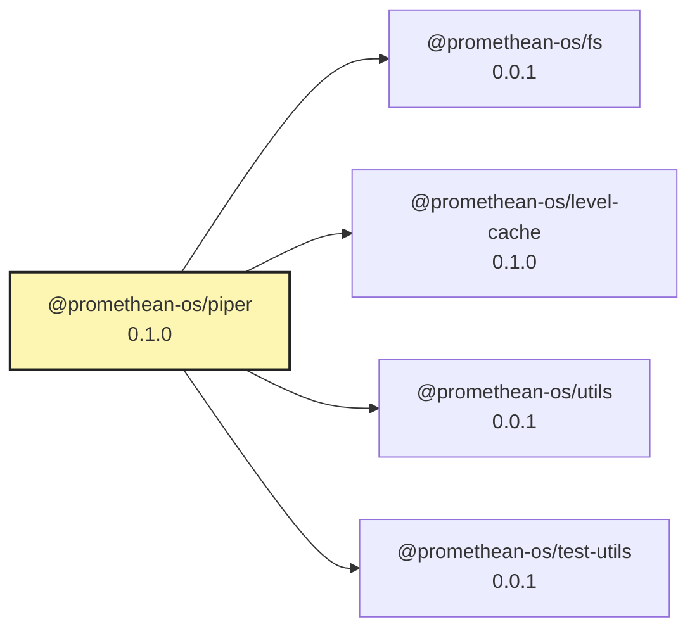

# @promethean-os/piper

Piper is a lightweight pipeline runner. It reads a `pipelines.json` file and executes the steps it defines.

## Dev UI

A minimal Fastify server is included to inspect pipelines and trigger steps from the browser.

```bash
pnpm --filter @promethean-os/piper dev-ui -- --config pipelines.json
```

Then open [http://localhost:3939](http://localhost:3939) to run individual steps. The UI lists pipelines and exposes buttons for each step while streaming logs back to the page.

<!-- READMEFLOW:BEGIN -->
# @promethean-os/piper


[TOC]


## Install

```bash
pnpm -w add -D @promethean-os/piper
```

## Quickstart

```ts
// usage example
```

## Commands

- `build`
- `typecheck`
- `test`
- `coverage`
- `clean`
- `prepack`
- `dev-ui`

## License

GPL-3.0-only


### Package graph




<!-- READMEFLOW:END -->
