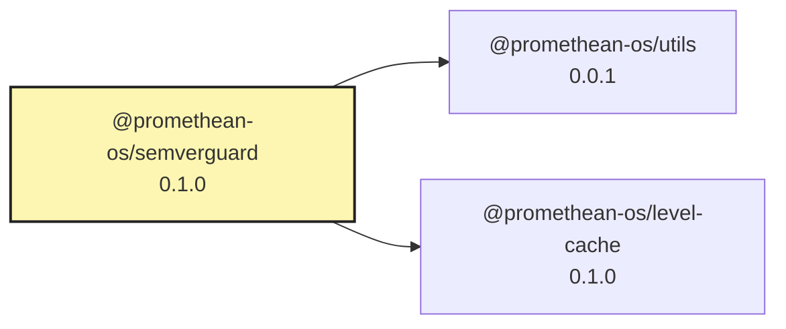

<!-- READMEFLOW:BEGIN -->
# @promethean-os/semverguard


[TOC]


## Install

```bash
pnpm -w add -D @promethean-os/semverguard
```

## Quickstart

```ts
// usage example
```

## Commands

- `build`
- `sv:01-snapshot`
- `sv:02-diff`
- `sv:03-plan`
- `sv:04-write`
- `sv:05-pr`
- `sv:all`

## License

GPL-3.0-only


### Package graph




<!-- READMEFLOW:END -->
