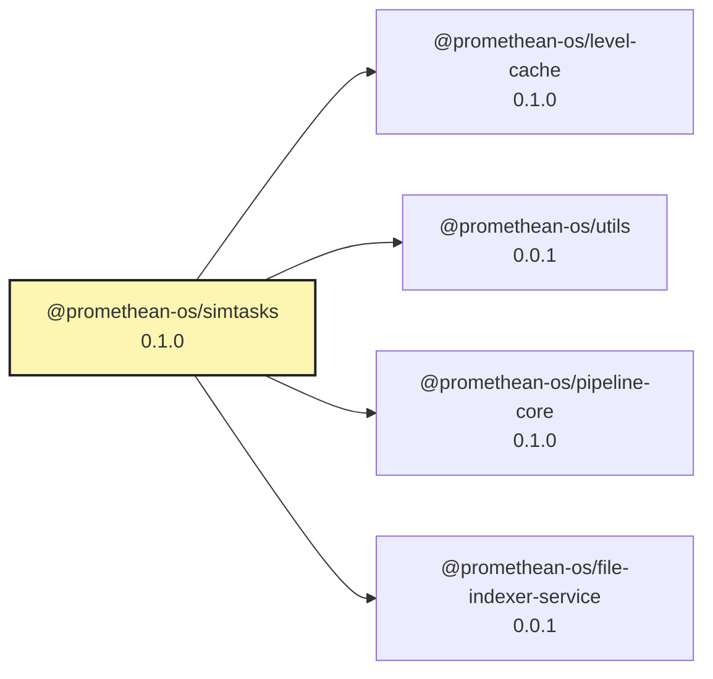

<!-- READMEFLOW:BEGIN -->
# @promethean-os/simtasks


[TOC]


## Install

```bash
pnpm -w add -D @promethean-os/simtasks
```

## Quickstart

```ts
// usage example
```

## Commands

- `build`
- `test`
- `sim:01-scan`
- `sim:02-embed`
- `sim:03-cluster`
- `sim:04-plan`
- `sim:05-write`
- `sim:all`

## License

GPL-3.0-only


### Package graph




<!-- READMEFLOW:END -->
