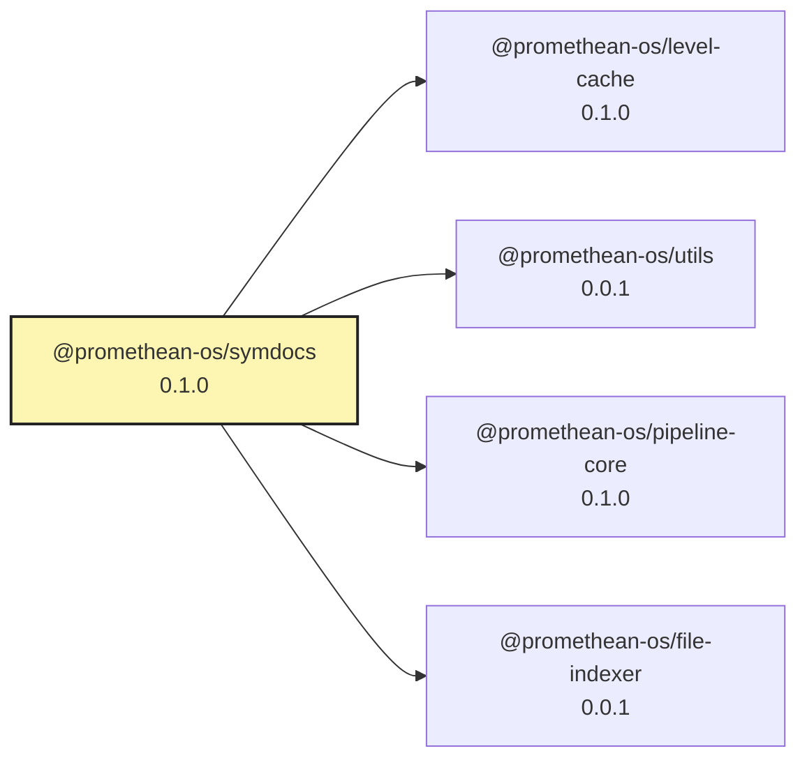

<!-- READMEFLOW:BEGIN -->
# @promethean-os/symdocs


[TOC]


## Install

```bash
pnpm -w add -D @promethean-os/symdocs
```

## Quickstart

```ts
// usage example
```

## Commands

- `build`
- `test`
- `symdocs:01-scan`
- `symdocs:02-docs`
- `symdocs:03-write`
- `symdocs:04-graph`
- `symdocs:all`

## License

GPL-3.0-only


### Package graph




<!-- READMEFLOW:END -->
