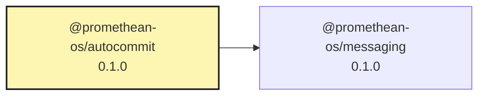

# @promethean-os/autocommit

Watches your git repo and automatically stages + commits changes with LLM-generated messages.

## Defaults

- **Endpoint:** `OPENAI_BASE_URL` (default `http://localhost:11434/v1`)
- **Model:** `AUTOCOMMIT_MODEL` (default `llama3.1:8b`)
- **Key:** `OPENAI_API_KEY` (optional for local Ollama)

## Install & Run (workspace)

```bash
pnpm --filter @promethean-os/autocommit install
pnpm --filter @promethean-os/autocommit build
pnpm --filter @promethean-os/autocommit exec autocommit -- --dry-run
```

## CLI

```
autocommit --path . --debounce-ms 10000 --model llama3.1:8b --dry-run
```

## Safety

- Respects `.gitignore` plus `--exclude`.
- Debounces to avoid noisy histories.
- Caps diff bytes to protect tokens & context.
- Falls back to deterministic messages when LLM unavailable.

## Promethean Packages (Remote READMEs)

- Back to [riatzukiza/promethean](https://github.com/riatzukiza/promethean#readme)

<!-- BEGIN: PROMETHEAN-PACKAGES-READMES -->
- [riatzukiza/agent-os-protocol](https://github.com/riatzukiza/agent-os-protocol#readme)
- [riatzukiza/ai-learning](https://github.com/riatzukiza/ai-learning#readme)
- [riatzukiza/apply-patch](https://github.com/riatzukiza/apply-patch#readme)
- [riatzukiza/auth-service](https://github.com/riatzukiza/auth-service#readme)
- [riatzukiza/autocommit](https://github.com/riatzukiza/autocommit#readme)
- [riatzukiza/build-monitoring](https://github.com/riatzukiza/build-monitoring#readme)
- [riatzukiza/cli](https://github.com/riatzukiza/cli#readme)
- [riatzukiza/clj-hacks-tools](https://github.com/riatzukiza/clj-hacks-tools#readme)
- [riatzukiza/compliance-monitor](https://github.com/riatzukiza/compliance-monitor#readme)
- [riatzukiza/dlq](https://github.com/riatzukiza/dlq#readme)
- [riatzukiza/ds](https://github.com/riatzukiza/ds#readme)
- [riatzukiza/eidolon-field](https://github.com/riatzukiza/eidolon-field#readme)
- [riatzukiza/enso-agent-communication](https://github.com/riatzukiza/enso-agent-communication#readme)
- [riatzukiza/http](https://github.com/riatzukiza/http#readme)
- [riatzukiza/kanban](https://github.com/riatzukiza/kanban#readme)
- [riatzukiza/logger](https://github.com/riatzukiza/logger#readme)
- [riatzukiza/math-utils](https://github.com/riatzukiza/math-utils#readme)
- [riatzukiza/mcp](https://github.com/riatzukiza/mcp#readme)
- [riatzukiza/mcp-dev-ui-frontend](https://github.com/riatzukiza/mcp-dev-ui-frontend#readme)
- [riatzukiza/migrations](https://github.com/riatzukiza/migrations#readme)
- [riatzukiza/naming](https://github.com/riatzukiza/naming#readme)
- [riatzukiza/obsidian-export](https://github.com/riatzukiza/obsidian-export#readme)
- [riatzukiza/omni-tools](https://github.com/riatzukiza/omni-tools#readme)
- [riatzukiza/opencode-hub](https://github.com/riatzukiza/opencode-hub#readme)
- [riatzukiza/persistence](https://github.com/riatzukiza/persistence#readme)
- [riatzukiza/platform](https://github.com/riatzukiza/platform#readme)
- [riatzukiza/plugin-hooks](https://github.com/riatzukiza/plugin-hooks#readme)
- [riatzukiza/report-forge](https://github.com/riatzukiza/report-forge#readme)
- [riatzukiza/security](https://github.com/riatzukiza/security#readme)
- [riatzukiza/shadow-conf](https://github.com/riatzukiza/shadow-conf#readme)
- [riatzukiza/snapshots](https://github.com/riatzukiza/snapshots#readme)
- [riatzukiza/test-classifier](https://github.com/riatzukiza/test-classifier#readme)
- [riatzukiza/test-utils](https://github.com/riatzukiza/test-utils#readme)
- [riatzukiza/utils](https://github.com/riatzukiza/utils#readme)
- [riatzukiza/worker](https://github.com/riatzukiza/worker#readme)
<!-- END: PROMETHEAN-PACKAGES-READMES -->

<!-- READMEFLOW:BEGIN -->
# @promethean-os/autocommit


[TOC]


## Install

```bash
pnpm -w add -D @promethean-os/autocommit
```

## Quickstart

```ts
// usage example
```

## Commands

- `build`
- `typecheck`
- `dev`
- `lint`
- `test`

## License

GPL-3.0-only


### Package graph




<!-- READMEFLOW:END -->
