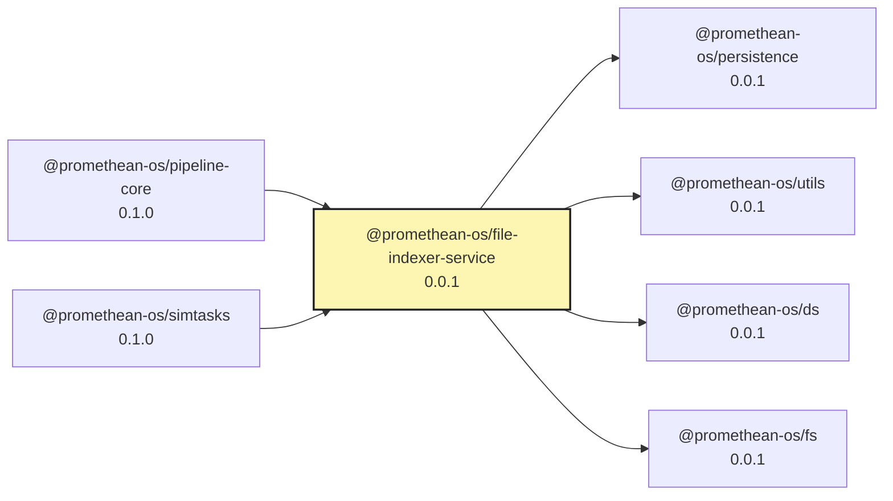

# @promethean-os/file-indexer-service

A file indexing service that leverages `@promethean-os/persistence` for persistent storage using DualStoreManager (MongoDB + ChromaDB).

## Features

- **Persistent Storage**: Uses DualStoreManager for dual storage in MongoDB and ChromaDB
- **Full-text Search**: Vector-based search using embeddings
- **File Metadata**: Stores file paths, sizes, types, and modification dates
- **REST API**: HTTP service for indexing and searching files
- **TypeScript**: Full type safety

## Installation

```bash
pnpm add @promethean-os/file-indexer-service
```

## Usage

### As a Library

```typescript
import { FileIndexer } from '@promethean-os/file-indexer-service';

const indexer = new FileIndexer('my_file_collection');
await indexer.initialize();

// Index a directory
const stats = await indexer.indexDirectory('/path/to/files', {
  includePatterns: ['.ts', '.js', '.md'],
  excludePatterns: ['node_modules', '.git'],
});

// Search for files
const results = await indexer.search('typescript patterns', 10);

// Get recent files
const recent = await indexer.getRecentFiles(5);
```

### As a Service

```typescript
import { FileIndexerService } from '@promethean-os/file-indexer-service/service.js';

const service = new FileIndexerService(3000);
await service.start();
```

## API Endpoints

### POST /search

Search for files by content.

```json
{
  "query": "typescript patterns",
  "limit": 10
}
```

### POST /index

Index a directory.

```json
{
  "path": "/path/to/files",
  "includePatterns": [".ts", ".js"],
  "excludePatterns": ["node_modules"],
  "followSymlinks": false
}
```

### GET /recent

Get recently indexed files.

Query parameters:

- `limit`: Number of files to return (default: 10)

### POST /file

Get a specific file by path.

```json
{
  "path": "/path/to/specific/file.ts"
}
```

### DELETE /file

Remove a file from the index.

```json
{
  "path": "/path/to/file/to/remove.ts"
}
```

### GET /stats

Get indexing statistics.

## Configuration

Environment variables:

- `PORT`: Service port (default: 3000)
- `EMBEDDING_FUNCTION`: Embedding function name (default: nomic-embed-text)
- `EMBEDDING_DRIVER`: Embedding driver (default: ollama)
- `DUAL_WRITE_ENABLED`: Enable dual writes to MongoDB and ChromaDB (default: true)

## Architecture

The service uses:

- **DualStoreManager**: For persistent storage across MongoDB and ChromaDB
- **FileIndexer**: Core indexing logic
- **FileIndexerService**: HTTP API layer

Files are stored with their content, metadata, and vector embeddings for efficient search.

## Development

```bash
# Install dependencies
pnpm install

# Build
pnpm build

# Test
pnpm test

# Start service
pnpm start
```

## License

Private package for Promethean Framework internal use.

<!-- READMEFLOW:BEGIN -->
# @promethean-os/file-indexer-service


[TOC]


## Install

```bash
pnpm -w add -D @promethean-os/file-indexer-service
```

## Quickstart

```ts
// usage example
```

## Commands

- `build`
- `clean`
- `typecheck`
- `test`
- `lint`
- `coverage`
- `format`

## License

GPL-3.0-only


### Package graph




<!-- READMEFLOW:END -->
