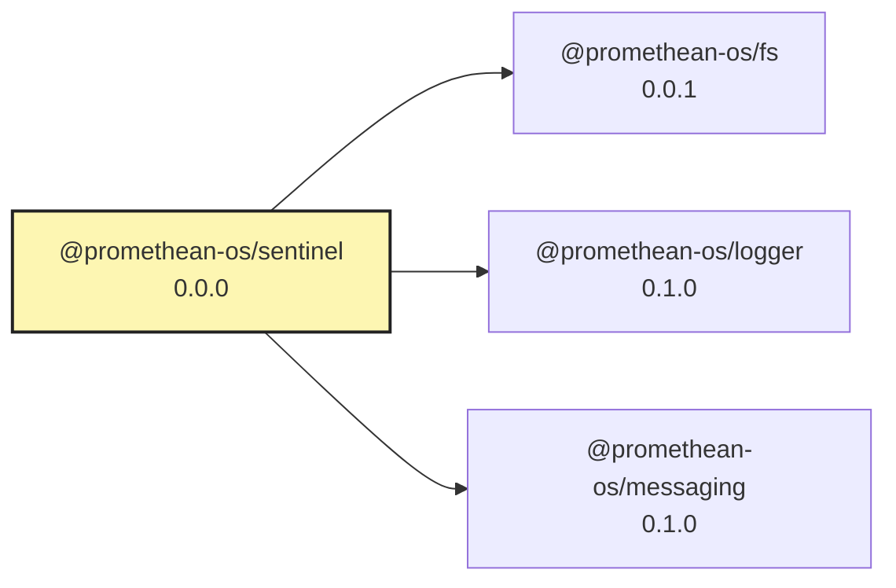

# Sentinel

Unified file-event spine for Promethean. Sentinel watches large trees (home- or repo-scoped), emits raw file events, and produces synthetic events (e.g., detected submodule moves) that downstream services consume over the messaging bus.

## Goals

- Single watcher to minimize file handles and duplicated work across services.
- Publish raw and synthetic events via `@promethean-os/messaging` topics.
- Submodule-aware workflows use `nodegit` (no shelling out to git).

## Status

Scaffold with working watcher wiring, pack loading, and synthetic emission + RPC hooks. Tests exist (`pnpm --filter @promethean-os/sentinel test`).

## Run

- Build once: `pnpm --filter @promethean-os/sentinel build`
- Launch (uses `SENTINEL_CONFIG` or `./sentinel.edn` at cwd):
  - `SENTINEL_CONFIG=/home/err/devel/orgs/riatzukiza/promethean/sentinel.edn node services/sentinel/dist/sentinel.cjs`
- Dev loop: keep `pnpm --filter @promethean-os/sentinel watch` running to refresh `dist/`, then rerun the `node .../dist/sentinel.cjs` command to restart.
- Workspace default config lives at repo root `sentinel.edn` and pulls the autocommit pack from `services/autocommit/sentinel.edn`, which in turn watches the main repo plus git submodules so pointer updates get committed.
- Messaging is optional at runtime; if `@promethean-os/messaging` is absent, RPC/events are skipped with a warning.

## Dev

- Build: `pnpm --filter @promethean-os/sentinel build`
- Watch: `pnpm --filter @promethean-os/sentinel watch`
- Test: `pnpm --filter @promethean-os/sentinel test`

## Config (EDN DSL)

- Default config path: `.sentinel.edn` at the chosen root (override with `SENTINEL_CONFIG`).
- Shape: top-level blocks for `:watchers`, `:apps` (processes), `:services` (containers), `:git-hooks`, `:github-actions`, `:nx`, optional `:packs`/`:use`.
- Path keywords can be nested like `:foo/bar/baz`. See `sentinel.complete.example.edn` or slimmed variants for starters.
- Packs: Sentinel will try to resolve `<pack>/sentinel.edn` via Node resolution and merge its watchers.
- Anchors: Sentinel watches for build anchors (`shadow-cljs.edn`, `bb.edn`, `nbb.edn`, `deps.edn`, `package.json`). When found, it will look for `sentinel.edn` and `sentinel.<anchor>.edn` next to them and load/unload packs accordingly, emitting `sentinel.detected` logs.
- Messaging: publishes `sentinel.detected` / `sentinel.pack.unloaded` and synthetic events (`sentinel.synthetic.<id>`). RPC queues: `sentinel.pack.add`, `sentinel.pack.remove`, `sentinel.pack.reload` (payload `{path}` or `{pack}`).

## Code structure (planned)

- `core.cljs` – entry/wiring
- `config.cljs`, `defaults.cljs`, `events.cljs`
- Actions: `actions/embedded.cljs`, `actions/handler_nb.cljs`, `actions/runner.cljs`
- Watchers: `watchers/engine.cljs` (existing)
- Apps: `apps/model.cljs`, `apps/pm2_bridge.cljs`
- Services: `services/model.cljs`, `services/docker_bridge.cljs`
- Git: `git/hooks_runner.cljs`, `git/nbb_hooks.cljs`
- GitHub: `gh/client.cljs`, `gh/runner.cljs`, `gh/model.cljs`
- Nx: `nx/model.cljs`, `nx/runner.cljs`
- Client: `client/node.cljs`
- Utilities: `util/io.cljs`

<!-- READMEFLOW:BEGIN -->
# @promethean-os/sentinel


[TOC]


## Install

```bash
pnpm -w add -D @promethean-os/sentinel
```

## Quickstart

```ts
// usage example
```

## Commands

- `build`
- `watch`
- `test`
- `clean`

## License

GPL-3.0-only


### Package graph




<!-- READMEFLOW:END -->
